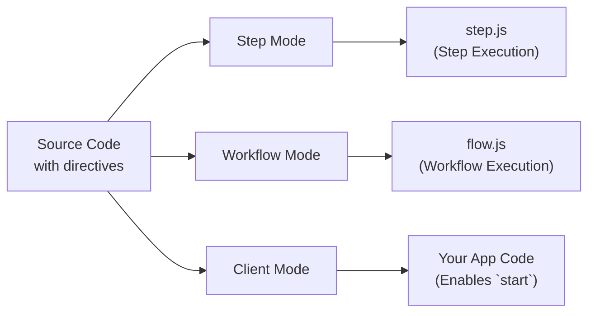

<Callout>
这是一个高级指南，深入介绍 Workflow DevKit 指令的内部实现，并非使用 workflows 的必读内容。要想简单使用 Workflow DevKit，请查看适用于您框架的[入门](/docs/getting-started) 指南。
</Callout>

工作流使用特殊指令来标记代码，以便由 Workflow DevKit 编译器进行转换。本页说明 `"use workflow"` 和 `"use step"` 指令的工作原理、应用的转换以及它们为何对持久化执行是必要的。

## 指令概述

工作流使用两个指令来标记需要特殊处理的函数：

```typescript
export async function handleUserSignup(email: string) {
  "use workflow"; // [!code highlight]

  const user = await createUser(email);
  await sendWelcomeEmail(user);

  return { userId: user.id };
}

async function createUser(email: string) {
  "use step"; // [!code highlight]

  return { id: crypto.randomUUID(), email };
}
```

**关键指令：**

- `"use workflow"`：将函数标记为可持久化工作流的入口点
- `"use step"`：将函数标记为原子、可重试的步骤

这些指令会触发 `@workflow/swc-plugin` 编译器，根据不同的执行上下文以不同方式转换您的代码。

## 三种转换模式

编译器在三种不同模式下运行，对相同源代码为每种执行上下文进行不同的转换：



### 比较表

| Mode     | Used In    | Purpose                        | Output API Route                   | Required? |
|----------|------------|--------------------------------|------------------------------------|-----------|
| Step     | Build time | 打包步骤处理程序               | `.well-known/workflow/v1/step`     | 是        |
| Workflow | Build time | 打包工作流编排器               | `.well-known/workflow/v1/flow`     | 是        |
| Client   | Build/Runtime | 为 `start` 提供工作流 ID 和类型 | 您的应用代码                        | 可选*     |

\* 客户端模式为更好的开发者体验**推荐**：它提供自动 ID 生成和类型安全。若不使用客户端模式，您必须手动构造工作流 ID 或使用构建清单。

## 详细转换示例

<Tabs items={["步骤模式", "工作流模式", "客户端模式"]}>
<Tab value="步骤模式">

**步骤模式** 会创建在 `/.well-known/workflow/v1/step` 提供的步骤执行包。

**输入：**

```typescript
export async function createUser(email: string) {
  "use step";
  return { id: crypto.randomUUID(), email };
}
```

**输出：**

```typescript
import { registerStepFunction } from "workflow/internal/private"; // [!code highlight]

export async function createUser(email: string) {
  return { id: crypto.randomUUID(), email };
}

registerStepFunction("step//workflows/user.js//createUser", createUser); // [!code highlight]
```

**发生了什么：**

- `"use step"` 指令被移除
- 函数体保持完全不变（没有转换）
- 使用 `registerStepFunction()` 将函数注册到运行时
- 步骤函数以完整的 Node.js/Deno/Bun 权限运行

**为什么没有转换？** 步骤函数在主运行时中执行，拥有对 Node.js API、文件系统、数据库等的完全访问权限。它们不需要特殊处理——按常规运行即可。

**ID 格式：** 步骤 ID 遵循模式 `step//{filepath}//{functionName}`，其中 filepath 相对于项目根路径。

</Tab>
<Tab value="工作流模式">

**工作流模式** 会创建在 `/.well-known/workflow/v1/flow` 提供的工作流执行包。

**输入：**

```typescript
export async function createUser(email: string) {
  "use step";
  return { id: crypto.randomUUID(), email };
}

export async function handleUserSignup(email: string) {
  "use workflow";
  const user = await createUser(email);
  return { userId: user.id };
}
```

**输出：**

```typescript
export async function createUser(email: string) {
  return globalThis[Symbol.for("WORKFLOW_USE_STEP")]("step//workflows/user.js//createUser")(email); // [!code highlight]
}

export async function handleUserSignup(email: string) {
  const user = await createUser(email);
  return { userId: user.id };
}
handleUserSignup.workflowId = "workflow//workflows/user.js//handleUserSignup"; // [!code highlight]
```

**发生了什么：**

- 步骤函数体被**替换为**对 `globalThis[Symbol.for("WORKFLOW_USE_STEP")]` 的调用
- 工作流函数体保持**不变**——它们在重放期间以确定性方式执行
- 工作流函数获得一个 `workflowId` 属性以供运行时识别
- `"use workflow"` 指令被移除

**为什么要进行此转换？** 当工作流执行时，需要从事件日志重放过去的步骤，而不是重新执行它们。`WORKFLOW_USE_STEP` 符号是一个特殊的运行时钩子，用于：

1. 检查步骤是否已在事件日志中执行过
2. 若是：返回缓存的结果
3. 若否：触发挂起并将步骤入列以在后台执行

**ID 格式：** 工作流 ID 遵循模式 `workflow//{filepath}//{functionName}`。`workflowId` 属性被附加到函数上，以便 [`start()`](/docs/api-reference/workflow-api/start) 在运行时能工作。

</Tab>
<Tab value="客户端模式">

**客户端模式** 在您的应用代码中转换工作流函数，以防止直接执行。

**输入：**

```typescript
export async function handleUserSignup(email: string) {
  "use workflow";
  const user = await createUser(email);
  return { userId: user.id };
}
```

**输出：**

```typescript
export async function handleUserSignup(email: string) {
  throw new Error("You attempted to execute ..."); // [!code highlight]
}
handleUserSignup.workflowId = "workflow//workflows/user.js//handleUserSignup"; // [!code highlight]
```

**发生了什么：**

- 工作流函数体被**替换为**抛出错误
- 添加了 `workflowId` 属性（与工作流模式相同）
- 步骤函数在客户端模式中不被转换

**为什么要进行此转换？** 工作流函数不能被直接调用——必须使用 [`start()`](/docs/api-reference/workflow-api/start) 来启动。抛出的错误能防止意外直接执行，而 `workflowId` 属性允许 `start()` 函数识别要启动的工作流。

这些 ID 的生成方式与工作流模式完全相同，以确保它们在运行时可以直接被引用。

<Callout type="info">
  **客户端模式为可选：** 虽然推荐以获得更好的开发者体验（自动 ID 和类型安全），您也可以跳过客户端模式，而改为：
  - 使用模式 `workflow//{filepath}//{functionName}` 手动构造工作流 ID
  - 使用构建期间生成的工作流清单文件查找 ID
  - 将 ID 直接作为字符串传递给 `start()`

  所有框架集成都默认将客户端模式作为 loader。
</Callout>

</Tab>
</Tabs>

## 生成的文件

构建应用时，Workflow DevKit 会在 `.well-known/workflow/v1/` 中生成三个处理程序文件：

### `flow.js`

包含所有以 **工作流模式** 转换的工作流函数。您的框架会导入此文件以处理 `POST /.well-known/workflow/v1/flow` 的工作流执行请求。

**结构说明：**

所有工作流代码会被打包并作为字符串嵌入到 `flow.js` 中。当工作流需要执行时，这段打包代码会在 **Node.js VM（虚拟机）** 中运行，以确保：

- **确定性**：相同输入始终产生相同输出
- **副作用防护**：阻止直接访问 Node.js API、文件系统、网络等
- **沙箱执行**：工作流编排逻辑与主运行时隔离

**构建时校验：**

工作流模式转换会在构建期间校验您的代码：

- 捕获对无效 Node.js API 的使用（如 `fs`, `http`, `child_process`）
- 防止导入会破坏确定性的模块

大多数无效模式会导致**构建时错误**，在部署前捕获问题。

**它做了什么：**

- 导出一个接受 Web 标准 `Request` 对象的 `POST` 处理器
- 在 Node.js VM 中为每个请求执行打包的工作流代码
- 处理工作流执行、重放和恢复
- 将执行结果返回给编排层

<Callout type="info">
  **为什么使用 VM？** 为了支持重放，工作流函数必须是确定性的。VM 沙箱可防止意外使用非确定性 API 或产生副作用。所有副作用应在[步骤函数](/docs/foundations/workflows-and-steps#step-functions) 中执行。
</Callout>

### `step.js`

包含所有以 **步骤模式** 转换的步骤函数。您的框架会导入此文件以处理 `POST /.well-known/workflow/v1/step` 的步骤执行请求。

**它做了什么：**

- 导出一个接受 Web 标准 `Request` 对象的 `POST` 处理器
- 使用完整运行时权限执行单个步骤
- 将步骤结果返回给编排层

### `webhook.js`

包含用于通过 [`createWebhook()`](/docs/api-reference/workflow/create-webhook) 向正在运行的工作流传递外部数据的 webhook 处理逻辑。

**它做了什么：**

- 导出一个接受 webhook 有效载荷的 `POST` 处理器
- 验证令牌并将数据路由到正确的工作流运行
- 在 webhook 交付后恢复工作流执行

**注意：** webhook 文件结构因框架而异。Next.js 会生成 `webhook/[token]/route.js` 以利用 App Router 的动态路由，而其他框架则生成单一的 `webhook.js` 或 `webhook.mjs` 处理程序。

## 为什么需要三种模式？

多模式转换使 Workflow DevKit 的持久化执行模型成为可能：

1. **步骤模式**（必需）— 打包可执行的步骤函数，允许访问完整运行时
2. **工作流模式**（必需）— 创建可从事件日志重放的编排逻辑
3. **客户端模式**（可选）— 防止直接执行并启用类型安全的工作流引用

这种分离带来：

- **确定性重放**：工作流可以安全地从事件日志重放，而不会重新执行副作用
- **沙箱化编排**：工作流逻辑在受控 VM 中运行，无法直接访问运行时
- **无状态执行**：计算可以扩展到零并从工作流的任意点恢复
- **类型安全**：TypeScript 与工作流引用无缝配合（在使用客户端模式时）

## 确定性与重放

转换的一个关键方面是为工作流函数维护**确定性重放**。

**工作流函数必须是确定性的：**

- 相同输入始终产生相同输出
- 无直接副作用（不进行 API 调用、数据库写入或文件 I/O）
- 可以使用 VM 提供的有种子化的随机/时间 API（如 `Math.random()`、`Date.now()` 等）

由于工作流函数是确定性的且没有副作用，它们可以被安全地多次重跑以计算下一步应执行的内容。这就是为什么工作流函数体在工作流模式中保持不变——它们是纯粹的编排逻辑。

**步骤函数可以是非确定性的：**

- 可以进行 API 调用、数据库查询等
- 对 Node.js 运行时和 API 有完全访问权限
- 首次执行后，其结果会被缓存到事件日志中

可在此了解更多关于[工作流和步骤](/docs/foundations/workflows-and-steps)的内容。

## ID 生成

编译器根据文件路径和函数名为工作流和步骤生成稳定的 ID：

**模式：** `{type}//{filepath}//{functionName}`

**示例：**

- `workflow//workflows/user-signup.js//handleUserSignup`
- `step//workflows/user-signup.js//createUser`
- `step//workflows/payments/checkout.ts//processPayment`

**关键属性：**

- **稳定**：除非重命名文件或函数，否则 ID 不会更改
- **唯一**：每个工作流/步骤都有独一无二的标识符
- **可移植**：在不同运行时和部署间均可使用

<Callout type="info">
  尽管在移动文件或重命名函数时 ID 可能会更改，Workflow DevKit 假设在世界范围内存在原子版本控制。这意味着更改 ID 不会阻止旧的工作流继续运行，但会阻止运行被升级，并会导致在部署间的可观测性中工作流/步骤名称发生变化。
</Callout>

## 框架集成

这些转换与框架无关——它们会输出可在任何地方运行的标准 JavaScript。

**针对使用者**：您的框架会自动处理所有转换。请参阅您框架的[入门](/docs/getting-started) 指南。

**针对框架作者**：了解如何将这些转换集成到您的框架中，请参阅[构建框架集成](/docs/how-it-works/framework-integrations)。

## 调试已转换的代码

如果需要调试转换问题，您可以检查生成的文件：

1. **查看 `.well-known/workflow/v1/`**：检查生成的 `flow.js`、`step.js`、`webhook.js` 以及其他输出的调试文件。
2. **检查构建日志**：大多数框架会在构建期间记录转换活动
3. **验证指令**：确保 `"use workflow"` 和 `"use step"` 是函数中的首条语句
4. **检查文件位置**：转换仅适用于配置的源目录中的文件