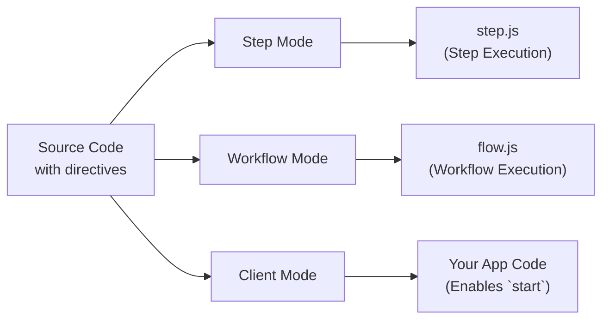

<Callout>
Esta es una guía avanzada que profundiza en los internals de la directiva del Workflow DevKit y no es lectura obligatoria para usar workflows. Para simplemente usar el Workflow DevKit, consulta las guías de [primeros pasos](/docs/getting-started) para tu framework.
</Callout>

Los flujos de trabajo usan directivas especiales para marcar código para su transformación por el compilador de Workflow DevKit. Esta página explica cómo funcionan las directivas `"use workflow"` y `"use step"`, qué transformaciones se aplican y por qué son necesarias para la ejecución durable.

## Resumen de directivas

Los flujos de trabajo usan dos directivas para marcar funciones que requieren un tratamiento especial:

```typescript
export async function handleUserSignup(email: string) {
  "use workflow"; // [!code highlight]

  const user = await createUser(email);
  await sendWelcomeEmail(user);

  return { userId: user.id };
}

async function createUser(email: string) {
  "use step"; // [!code highlight]

  return { id: crypto.randomUUID(), email };
}
```

**Directivas clave:**

- `"use workflow"`: Marca una función como punto de entrada de un workflow durable
- `"use step"`: Marca una función como un paso atómico y reintentable

Estas directivas activan el compilador `@workflow/swc-plugin` para transformar tu código de distintas maneras según el contexto de ejecución.

## Los tres modos de transformación

El compilador opera en tres modos distintos, transformando el mismo código fuente de forma diferente para cada contexto de ejecución:



### Tabla comparativa

| Mode     | Used In    | Purpose                        | Output API Route                   | Required? |
|----------|------------|--------------------------------|------------------------------------|-----------|
| Step     | Build time | Bundles step handlers          | `.well-known/workflow/v1/step`  | Yes       |
| Workflow | Build time | Bundles workflow orchestrators | `.well-known/workflow/v1/flow`  | Yes       |
| Client   | Build/Runtime | Provides workflow IDs and types to `start`   | Your application code              | Optional* |

\* El modo Client es **recomendado** para una mejor experiencia de desarrollo: proporciona generación automática de IDs y seguridad de tipos. Sin él, debes construir manualmente los IDs de workflow o usar el manifiesto de build.

## Ejemplos detallados de transformación

<Tabs items={["Step Mode", "Workflow Mode", "Client Mode"]}>
<Tab value="Step Mode">

**Modo de paso** crea el bundle de ejecución de pasos servido en `/.well-known/workflow/v1/step`.

**Entrada:**

```typescript
export async function createUser(email: string) {
  "use step";
  return { id: crypto.randomUUID(), email };
}
```

**Salida:**

```typescript
import { registerStepFunction } from "workflow/internal/private"; // [!code highlight]

export async function createUser(email: string) {
  return { id: crypto.randomUUID(), email };
}

registerStepFunction("step//workflows/user.js//createUser", createUser); // [!code highlight]
```

**Qué ocurre:**

- La directiva `"use step"` se elimina
- El cuerpo de la función se mantiene completamente intacto (sin transformación)
- La función se registra con el runtime usando `registerStepFunction()`
- Las funciones de paso se ejecutan con acceso completo a Node.js/Deno/Bun

**¿Por qué no hay transformación?** Las funciones de paso se ejecutan en tu runtime principal con acceso total a las APIs de Node.js, sistema de archivos, bases de datos, etc. No necesitan un tratamiento especial: simplemente se ejecutan de forma normal.

**Formato de ID:** Los IDs de paso siguen el patrón `step//{filepath}//{functionName}`, donde el filepath es relativo a la raíz de tu proyecto.

</Tab>
<Tab value="Workflow Mode">

**Modo de flujo de trabajo** crea el bundle de ejecución de workflows servido en `/.well-known/workflow/v1/flow`.

**Entrada:**

```typescript
export async function createUser(email: string) {
  "use step";
  return { id: crypto.randomUUID(), email };
}

export async function handleUserSignup(email: string) {
  "use workflow";
  const user = await createUser(email);
  return { userId: user.id };
}
```

**Salida:**

```typescript
export async function createUser(email: string) {
  return globalThis[Symbol.for("WORKFLOW_USE_STEP")]("step//workflows/user.js//createUser")(email); // [!code highlight]
}

export async function handleUserSignup(email: string) {
  const user = await createUser(email);
  return { userId: user.id };
}
handleUserSignup.workflowId = "workflow//workflows/user.js//handleUserSignup"; // [!code highlight]
```

**Qué ocurre:**

- Los cuerpos de las funciones de paso se **reemplazan** por llamadas a `globalThis[Symbol.for("WORKFLOW_USE_STEP")]`
- Los cuerpos de las funciones de workflow permanecen **intactos**: se ejecutan de forma determinista durante el replay
- A la función de workflow se le añade la propiedad `workflowId` para la identificación en tiempo de ejecución
- La directiva `"use workflow"` se elimina

**¿Por qué esta transformación?** Cuando un workflow se ejecuta, necesita volver a reproducir pasos pasados desde el registro de eventos en lugar de re-ejecutarlos. El símbolo `WORKFLOW_USE_STEP` es un hook especial del runtime que:

1. Verifica si el paso ya se ejecutó (en el registro de eventos)
2. Si sí: devuelve el resultado en caché
3. Si no: provoca una suspensión y encola el paso para ejecución en background

**Formato de ID:** Los IDs de workflow siguen el patrón `workflow//{filepath}//{functionName}`. La propiedad `workflowId` se adjunta a la función para permitir que [`start()`](/docs/api-reference/workflow-api/start) funcione en tiempo de ejecución.

</Tab>
<Tab value="Client Mode">

**Modo cliente** transforma las funciones de workflow en el código de tu aplicación para evitar su ejecución directa.

**Entrada:**

```typescript
export async function handleUserSignup(email: string) {
  "use workflow";
  const user = await createUser(email);
  return { userId: user.id };
}
```

**Salida:**

```typescript
export async function handleUserSignup(email: string) {
  throw new Error("You attempted to execute ..."); // [!code highlight]
}
handleUserSignup.workflowId = "workflow//workflows/user.js//handleUserSignup"; // [!code highlight]
```

**Qué ocurre:**

- Los cuerpos de las funciones de workflow se **reemplazan** por un lanzamiento de error
- Se añade la propiedad `workflowId` (igual que en el modo workflow)
- Las funciones de paso no se transforman en modo cliente

**¿Por qué esta transformación?** Las funciones de workflow no pueden llamarse directamente: deben iniciarse usando [`start()`](/docs/api-reference/workflow-api/start). El error evita ejecuciones accidentales directas mientras que la propiedad `workflowId` permite que la función `start()` identifique qué workflow lanzar.

Los IDs se generan exactamente igual que en el modo workflow para garantizar que puedan referenciarse directamente en tiempo de ejecución.

<Callout type="info">
  **El modo cliente es opcional:** Aunque se recomienda para una mejor experiencia de desarrollo (IDs automáticos y seguridad de tipos), puedes omitir el modo cliente y en su lugar:
  - Construir manualmente los IDs de workflow usando el patrón `workflow//{filepath}//{functionName}`
  - Usar el archivo de manifiesto de workflow generado durante el build para buscar IDs
  - Pasar IDs directamente a `start()` como cadenas

  Todas las integraciones de framework incluyen el modo cliente como un loader por defecto.
</Callout>

</Tab>
</Tabs>

## Archivos generados

Cuando construyes tu aplicación, el Workflow DevKit genera tres archivos manejadores en `.well-known/workflow/v1/`:

### `flow.js`

Contiene todas las funciones de workflow transformadas en **modo workflow**. Este archivo es importado por tu framework para manejar las solicitudes de ejecución de workflows en `POST /.well-known/workflow/v1/flow`.

**Cómo está estructurado:**

Todo el código de workflow se agrupa y se incrusta como una cadena dentro de `flow.js`. Cuando se necesita ejecutar un workflow, este código agrupado se ejecuta dentro de una **VM de Node.js** (máquina virtual) para asegurar:

- **Determinismo**: Las mismas entradas siempre producen los mismos resultados
- **Prevención de efectos secundarios**: Se bloquea el acceso directo a las APIs de Node.js, sistema de archivos, red, etc.
- **Ejecución en sandbox**: La lógica de orquestación del workflow está aislada del runtime principal

**Validación en tiempo de build:**

La transformación en modo workflow valida tu código durante la compilación:

- Detecta el uso inválido de APIs de Node.js (como `fs`, `http`, `child_process`)
- Previene importaciones de módulos que romperían el determinismo

La mayoría de los patrones inválidos provocan **errores en tiempo de build**, detectando problemas antes del despliegue.

**Qué hace:**

- Exporta un handler `POST` que acepta objetos `Request` estándar Web
- Ejecuta el código de workflow agrupado dentro de una VM de Node.js por cada solicitud
- Maneja la ejecución del workflow, el replay y la reanudación
- Devuelve los resultados de ejecución a la capa de orquestación

<Callout type="info">
  **¿Por qué una VM?** Las funciones de workflow deben ser deterministas para soportar el replay. La sandbox de la VM evita el uso accidental de APIs no deterministas o efectos secundarios. Todos los efectos secundarios deben realizarse en las [funciones de paso](/docs/foundations/workflows-and-steps#step-functions).
</Callout>

### `step.js`

Contiene todas las funciones de paso transformadas en **modo de paso**. Este archivo es importado por tu framework para manejar las solicitudes de ejecución de pasos en `POST /.well-known/workflow/v1/step`.

**Qué hace:**

- Exporta un handler `POST` que acepta objetos `Request` estándar Web
- Ejecuta pasos individuales con acceso completo al runtime
- Devuelve los resultados de los pasos a la capa de orquestación

### `webhook.js`

Contiene la lógica de manejo de webhooks para entregar datos externos a workflows en ejecución vía [`createWebhook()`](/docs/api-reference/workflow/create-webhook).

**Qué hace:**

- Exporta un handler `POST` que acepta payloads de webhook
- Valida tokens y enruta datos al run de workflow correcto
- Reanuda la ejecución del workflow tras la entrega del webhook

**Nota:** La estructura del archivo de webhook varía según el framework. Next.js genera `webhook/[token]/route.js` para aprovechar el enrutamiento dinámico del App Router, mientras que otros frameworks generan un único handler `webhook.js` o `webhook.mjs`.

## ¿Por qué tres modos?

La transformación multinivel permite el modelo de ejecución durable del Workflow DevKit:

1. **Modo de paso** (requerido) - Agrupa funciones de paso ejecutables que pueden acceder al runtime completo
2. **Modo workflow** (requerido) - Crea la lógica de orquestación que puede reproducirse desde registros de eventos
3. **Modo cliente** (opcional) - Evita la ejecución directa y habilita referencias de workflow con seguridad de tipos

Esta separación permite:

- **Replay determinista**: Los workflows pueden reproducirse desde registros de eventos sin re-ejecutar efectos secundarios
- **Orquestación en sandbox**: La lógica de workflow se ejecuta en una VM controlada sin acceso directo al runtime
- **Ejecución sin estado**: Tu cómputo puede escalar a cero y reanudar desde cualquier punto del workflow
- **Seguridad de tipos**: TypeScript funciona de forma transparente con referencias de workflow (cuando se usa el modo cliente)

## Determinismo y replay

Un aspecto clave de la transformación es mantener un **replay determinista** para las funciones de workflow.

**Las funciones de workflow deben ser deterministas:**

- Las mismas entradas siempre producen las mismas salidas
- No tener efectos secundarios directos (sin llamadas a APIs, sin escrituras en bases de datos, sin I/O de archivos)
- Pueden usar APIs de tiempo/aleatoriedad con semilla proporcionadas por la VM (`Math.random()`, `Date.now()`, etc.)

Dado que las funciones de workflow son deterministas y no tienen efectos secundarios, pueden ejecutarse de forma segura varias veces para calcular cuál debe ser el siguiente paso. Por eso los cuerpos de las funciones de workflow permanecen intactos en modo workflow: son lógica de orquestación pura.

**Las funciones de paso pueden ser no deterministas:**

- Pueden realizar llamadas a APIs, consultas a bases de datos, etc.
- Tienen acceso completo al runtime y a las APIs de Node.js
- Los resultados se almacenan en caché en el registro de eventos tras la primera ejecución

Aprende más sobre [Flujos de trabajo y pasos](/docs/foundations/workflows-and-steps).

## Generación de IDs

El compilador genera IDs estables para workflows y pasos basándose en rutas de archivo y nombres de función:

**Pattern:** `{type}//{filepath}//{functionName}`

**Ejemplos:**

- `workflow//workflows/user-signup.js//handleUserSignup`
- `step//workflows/user-signup.js//createUser`
- `step//workflows/payments/checkout.ts//processPayment`

**Propiedades clave:**

- **Estables**: Los IDs no cambian a menos que renombres archivos o funciones
- **Únicos**: Cada workflow/paso tiene un identificador único
- **Portables**: Funcionan en distintos runtimes y despliegues

<Callout type="info">
  Aunque los IDs pueden cambiar cuando se mueven archivos o se renombran funciones, Workflow DevKit asume un versionado atómico en el mundo. Esto significa que cambiar los IDs no impedirá que ejecuciones antiguas sigan funcionando, pero evitará que una ejecución pueda actualizarse y provocará que los nombres de tus workflows/pasos cambien en la observabilidad entre despliegues.
</Callout>

## Integración con frameworks

Estas transformaciones son agnósticas al framework: generan JavaScript estándar que funciona en cualquier lugar.

**Para usuarios**: Tu framework maneja todas las transformaciones automáticamente. Consulta la guía de [Primeros pasos](/docs/getting-started) para tu framework.

**Para autores de frameworks**: Aprende a integrar estas transformaciones en tu framework en [Integración con frameworks](/docs/how-it-works/framework-integrations).

## Depuración del código transformado

Si necesitas depurar problemas de transformación, puedes inspeccionar los archivos generados:

1. **Busca en `.well-known/workflow/v1/`**: Revisa los archivos generados `flow.js`, `step.js`, `webhook.js` y otros archivos de depuración emitidos.
2. **Revisa los logs de build**: La mayoría de los frameworks registran la actividad de transformación durante las compilaciones
3. **Verifica las directivas**: Asegúrate de que `"use workflow"` y `"use step"` sean las primeras declaraciones en las funciones
4. **Comprueba las ubicaciones de archivos**: Las transformaciones solo se aplican a archivos en los directorios de origen configurados