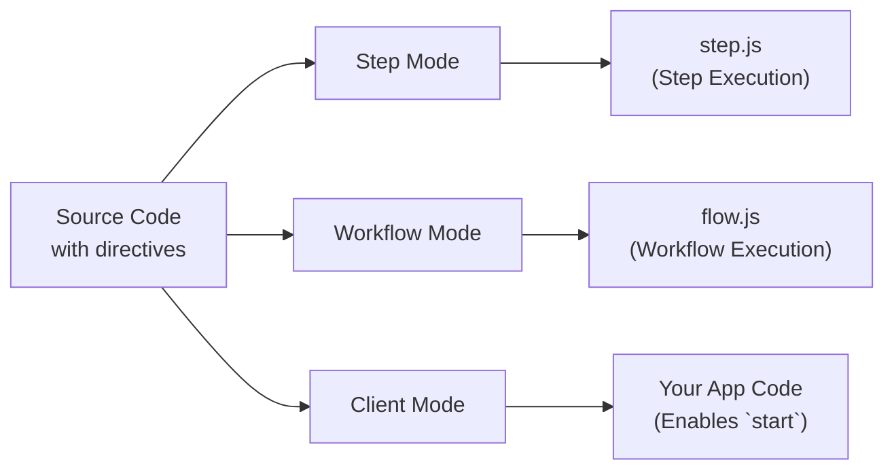

<Callout>
Il s'agit d'un guide avancé qui explore les mécanismes internes de la directive Workflow DevKit et qui n'est pas nécessaire pour utiliser les workflows. Pour simplement utiliser le Workflow DevKit, consultez les guides [démarrage](/docs/getting-started) pour votre framework.
</Callout>

Les workflows utilisent des directives spéciales pour marquer le code en vue de sa transformation par le compilateur Workflow DevKit. Cette page explique comment fonctionnent les directives `"use workflow"` et `"use step"`, quelles transformations sont appliquées et pourquoi elles sont nécessaires pour une exécution durable.

## Aperçu des directives

Les workflows utilisent deux directives pour marquer les fonctions nécessitant un traitement particulier :

```typescript
export async function handleUserSignup(email: string) {
  "use workflow"; // [!code highlight]

  const user = await createUser(email);
  await sendWelcomeEmail(user);

  return { userId: user.id };
}

async function createUser(email: string) {
  "use step"; // [!code highlight]

  return { id: crypto.randomUUID(), email };
}
```

**Directives clés :**

- `"use workflow"` : Marque une fonction comme point d'entrée durable du workflow
- `"use step"` : Marque une fonction comme une étape atomique et retentable

Ces directives déclenchent le compilateur `@workflow/swc-plugin` pour transformer votre code de différentes manières selon le contexte d'exécution.

## Les trois modes de transformation

Le compilateur opère en trois modes distincts, transformant le même code source différemment pour chaque contexte d'exécution :



### Tableau comparatif

| Mode     | Utilisé dans    | Objectif                        | Route API de sortie                   | Requis ? |
|----------|-----------------|----------------------------------|---------------------------------------|----------|
| Step     | Au build        | Regroupe les gestionnaires d'étape | `.well-known/workflow/v1/step`        | Oui      |
| Workflow | Au build        | Regroupe les orchestrateurs de workflow | `.well-known/workflow/v1/flow`        | Oui      |
| Client   | Build/Runtime   | Fournit des IDs et types de workflow à `start` | Votre code d'application              | Optionnel* |

\* Le mode client est **recommandé** pour une meilleure expérience développeur — il fournit une génération automatique d'ID et la sécurité de types. Sans lui, vous devez construire manuellement les identifiants de workflow ou utiliser le manifeste de build.

## Exemples détaillés de transformation

<Tabs items={["Step Mode", "Workflow Mode", "Client Mode"]}>
<Tab value="Step Mode">

**Le mode étape** crée le bundle d'exécution des étapes servi à `/.well-known/workflow/v1/step`.

**Entrée :**

```typescript
export async function createUser(email: string) {
  "use step";
  return { id: crypto.randomUUID(), email };
}
```

**Sortie :**

```typescript
import { registerStepFunction } from "workflow/internal/private"; // [!code highlight]

export async function createUser(email: string) {
  return { id: crypto.randomUUID(), email };
}

registerStepFunction("step//workflows/user.js//createUser", createUser); // [!code highlight]
```

**Ce qui se passe :**

- La directive `"use step"` est supprimée
- Le corps de la fonction est conservé totalement intact (aucune transformation)
- La fonction est enregistrée auprès du runtime en utilisant `registerStepFunction()`
- Les fonctions d'étape s'exécutent avec un accès complet à Node.js/Deno/Bun

**Pourquoi pas de transformation ?** Les fonctions d'étape s'exécutent dans votre runtime principal avec un accès complet aux API Node.js, au système de fichiers, aux bases de données, etc. Elles n'ont pas besoin de traitement spécial — elles s'exécutent normalement.

**Format d'ID :** Les identifiants d'étape suivent le modèle `step//{filepath}//{functionName}`, où le chemin de fichier est relatif à la racine de votre projet.

</Tab>
<Tab value="Workflow Mode">

**Le mode workflow** crée le bundle d'exécution des workflows servi à `/.well-known/workflow/v1/flow`.

**Entrée :**

```typescript
export async function createUser(email: string) {
  "use step";
  return { id: crypto.randomUUID(), email };
}

export async function handleUserSignup(email: string) {
  "use workflow";
  const user = await createUser(email);
  return { userId: user.id };
}
```

**Sortie :**

```typescript
export async function createUser(email: string) {
  return globalThis[Symbol.for("WORKFLOW_USE_STEP")]("step//workflows/user.js//createUser")(email); // [!code highlight]
}

export async function handleUserSignup(email: string) {
  const user = await createUser(email);
  return { userId: user.id };
}
handleUserSignup.workflowId = "workflow//workflows/user.js//handleUserSignup"; // [!code highlight]
```

**Ce qui se passe :**

- Les corps des fonctions d'étape sont **remplacés** par des appels à `globalThis[Symbol.for("WORKFLOW_USE_STEP")]`
- Les corps des fonctions de workflow restent **intacts** — ils s'exécutent de manière déterministe lors du replay
- La fonction de workflow reçoit une propriété `workflowId` pour l'identification au runtime
- La directive `"use workflow"` est supprimée

**Pourquoi cette transformation ?** Lorsqu'un workflow s'exécute, il doit rejouer les étapes passées à partir du journal d'événements plutôt que de les réexécuter. Le symbole `WORKFLOW_USE_STEP` est un hook runtime spécial qui :

1. Vérifie si l'étape a déjà été exécutée (dans le journal d'événements)
2. Si oui : renvoie le résultat mis en cache
3. Si non : déclenche une suspension et met l'étape en file d'attente pour exécution en arrière-plan

**Format d'ID :** Les identifiants de workflow suivent le modèle `workflow//{filepath}//{functionName}`. La propriété `workflowId` est attachée à la fonction pour permettre à [`start()`](/docs/api-reference/workflow-api/start) de fonctionner au runtime.

</Tab>
<Tab value="Client Mode">

**Le mode client** transforme les fonctions de workflow dans votre code applicatif pour empêcher leur exécution directe.

**Entrée :**

```typescript
export async function handleUserSignup(email: string) {
  "use workflow";
  const user = await createUser(email);
  return { userId: user.id };
}
```

**Sortie :**

```typescript
export async function handleUserSignup(email: string) {
  throw a new Error("You attempted to execute ..."); // [!code highlight]
}
handleUserSignup.workflowId = "workflow//workflows/user.js//handleUserSignup"; // [!code highlight]
```

**Ce qui se passe :**

- Les corps des fonctions de workflow sont **remplacés** par un lancer d'erreur
- La propriété `workflowId` est ajoutée (identique à celle du mode workflow)
- Les fonctions d'étape ne sont pas transformées en mode client

**Pourquoi cette transformation ?** Les fonctions de workflow ne peuvent pas être appelées directement — elles doivent être démarrées en utilisant [`start()`](/docs/api-reference/workflow-api/start). L'erreur empêche une exécution accidentelle directe tandis que la propriété `workflowId` permet à la fonction `start()` d'identifier quel workflow lancer.

Les IDs sont générés exactement comme en mode workflow pour garantir qu'ils puissent être référencés directement au runtime.

<Callout type="info">
  **Le mode client est optionnel :** Bien que recommandé pour une meilleure expérience développeur (IDs automatiques et sécurité de types), vous pouvez ignorer le mode client et à la place :
  - Construire manuellement les identifiants de workflow en utilisant le modèle `workflow//{filepath}//{functionName}`
  - Utiliser le fichier manifeste de workflow généré durant le build pour rechercher les IDs
  - Passer les IDs directement à `start()` sous forme de chaînes

  Toutes les intégrations de framework incluent le mode client comme loader par défaut.
</Callout>

</Tab>
</Tabs>

## Fichiers générés

Lorsque vous buildiez votre application, le Workflow DevKit génère trois fichiers gestionnaires dans `.well-known/workflow/v1/` :

### `flow.js`

Contient toutes les fonctions de workflow transformées en **mode workflow**. Ce fichier est importé par votre framework pour gérer les requêtes d'exécution de workflow à `POST /.well-known/workflow/v1/flow`.

**Comment il est structuré :**

Tout le code de workflow est regroupé et intégré comme une chaîne à l'intérieur de `flow.js`. Lorsqu'un workflow doit s'exécuter, ce code embarqué est exécuté à l'intérieur d'une **Node.js VM** (machine virtuelle) afin de garantir :

- **Déterminisme** : Les mêmes entrées produisent toujours les mêmes sorties
- **Prévention des effets secondaires** : L'accès direct aux API Node.js, au système de fichiers, au réseau, etc. est bloqué
- **Exécution sandboxée** : La logique d'orchestration du workflow est isolée du runtime principal

**Validation au build :**

La transformation en mode workflow valide votre code durant la construction :

- Détecte l'utilisation invalide d'API Node.js (comme `fs`, `http`, `child_process`)
- Empêche les imports de modules qui nuiraient au déterminisme

La plupart des motifs invalides entraînent des **erreurs au build**, permettant de détecter les problèmes avant le déploiement.

**Ce que cela fait :**

- Exporte un gestionnaire `POST` qui accepte des objets Web standard `Request`
- Exécute le code bundlé du workflow à l'intérieur d'une Node.js VM pour chaque requête
- Gère l'exécution, le replay et la reprise des workflows
- Retourne les résultats d'exécution à la couche d'orchestration

<Callout type="info">
  **Pourquoi une VM ?** Les fonctions de workflow doivent être déterministes pour supporter le replay. Le sandbox de la VM empêche l'utilisation accidentelle d'API non déterministes ou d'effets secondaires. Tous les effets secondaires doivent être effectués dans des [fonctions d'étape](/docs/foundations/workflows-and-steps#step-functions).
</Callout>

### `step.js`

Contient toutes les fonctions d'étape transformées en **mode étape**. Ce fichier est importé par votre framework pour gérer les requêtes d'exécution d'étape à `POST /.well-known/workflow/v1/step`.

**Ce que cela fait :**

- Exporte un gestionnaire `POST` qui accepte des objets Web standard `Request`
- Exécute les étapes individuelles avec un accès complet au runtime
- Retourne les résultats des étapes à la couche d'orchestration

### `webhook.js`

Contient la logique de gestion des webhooks pour délivrer des données externes aux workflows en cours via [`createWebhook()`](/docs/api-reference/workflow/create-webhook).

**Ce que cela fait :**

- Exporte un gestionnaire `POST` qui accepte les payloads de webhook
- Valide les tokens et achemine les données vers l'exécution de workflow correcte
- Reprend l'exécution du workflow après la livraison du webhook

**Remarque :** La structure du fichier webhook varie selon le framework. Next.js génère `webhook/[token]/route.js` pour tirer parti du routage dynamique de l'App Router, tandis que d'autres frameworks génèrent un unique gestionnaire `webhook.js` ou `webhook.mjs`.

## Pourquoi trois modes ?

La transformation multi-mode permet le modèle d'exécution durable du Workflow DevKit :

1. **Mode étape** (requis) - Regroupe les fonctions d'étape exécutables qui peuvent accéder au runtime complet
2. **Mode workflow** (requis) - Crée la logique d'orchestration capable de rejouer depuis les journaux d'événements
3. **Mode client** (optionnel) - Empêche l'exécution directe et permet des références de workflow sûres en types

Cette séparation permet :

- **Replay déterministe** : Les workflows peuvent être rejoués en toute sécurité à partir des journaux d'événements sans réexécuter les effets secondaires
- **Orchestration sandboxée** : La logique de workflow s'exécute dans une VM contrôlée sans accès direct au runtime
- **Exécution sans état** : Votre calcul peut scalers à zéro et reprendre depuis n'importe quel point du workflow
- **Sécurité de types** : TypeScript fonctionne de manière transparente avec les références de workflow (lors de l'utilisation du mode client)

## Déterminisme et replay

Un aspect clé de la transformation est le maintien d'un **replay déterministe** pour les fonctions de workflow.

**Les fonctions de workflow doivent être déterministes :**

- Les mêmes entrées produisent toujours les mêmes sorties
- Pas d'effets secondaires directs (pas d'appels d'API, pas d'écritures en base de données, pas d'E/S de fichiers)
- Peuvent utiliser des API aléatoires/temps semées fournies par la VM (`Math.random()`, `Date.now()`, etc.)

Parce que les fonctions de workflow sont déterministes et sans effets secondaires, elles peuvent être réexécutées en toute sécurité plusieurs fois pour calculer quelle doit être la prochaine étape. C'est pourquoi les corps des fonctions de workflow restent intacts en mode workflow — ce sont de la logique d'orchestration pure.

**Les fonctions d'étape peuvent être non déterministes :**

- Peuvent effectuer des appels d'API, des requêtes en base de données, etc.
- Ont un accès complet au runtime et aux APIs Node.js
- Les résultats sont mis en cache dans le journal d'événements après la première exécution

En savoir plus sur les [Workflows et les étapes](/docs/foundations/workflows-and-steps).

## Génération d'ID

Le compilateur génère des IDs stables pour les workflows et les étapes basés sur les chemins de fichiers et les noms de fonctions :

**Modèle :** `{type}//{filepath}//{functionName}`

**Exemples :**

- `workflow//workflows/user-signup.js//handleUserSignup`
- `step//workflows/user-signup.js//createUser`
- `step//workflows/payments/checkout.ts//processPayment`

**Propriétés clés :**

- **Stable** : Les IDs ne changent pas sauf si vous renommez des fichiers ou des fonctions
- **Unique** : Chaque workflow/étape a un identifiant unique
- **Portable** : Fonctionne à travers différents runtimes et déploiements

<Callout type="info">
  Bien que les IDs puissent changer lorsque des fichiers sont déplacés ou des fonctions renommées, les fonctions Workflow DevKit supposent un versioning atomique dans le monde. Cela signifie que changer les IDs n'empêchera pas l'exécution des anciens workflows, mais empêchera la mise à niveau des runs et entraînera un changement des noms de vos workflows/étapes dans l'observabilité à travers les déploiements.
</Callout>

## Intégration au framework

Ces transformations sont agnostiques au framework — elles produisent du JavaScript standard qui fonctionne partout.

**Pour les utilisateurs** : Votre framework gère automatiquement toutes les transformations. Voir le guide [Getting Started](/docs/getting-started) pour votre framework.

**Pour les auteurs de framework** : Apprenez à intégrer ces transformations dans votre framework dans [Building Framework Integrations](/docs/how-it-works/framework-integrations).

## Débogage du code transformé

Si vous devez déboguer des problèmes de transformation, vous pouvez inspecter les fichiers générés :

1. **Regardez dans `.well-known/workflow/v1/`** : Vérifiez les fichiers générés `flow.js`, `step.js`, `webhook.js` et autres fichiers de debug émis.
2. **Vérifiez les logs de build** : La plupart des frameworks consignent l'activité de transformation pendant les builds
3. **Vérifiez les directives** : Assurez-vous que `"use workflow"` et `"use step"` sont les premières instructions dans les fonctions
4. **Vérifiez les emplacements de fichiers** : Les transformations ne s'appliquent qu'aux fichiers dans les répertoires source configurés