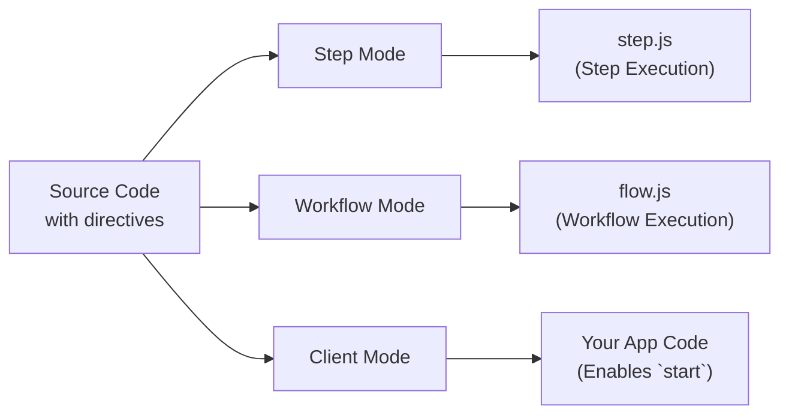

<Callout>
Ini adalah panduan lanjutan yang membahas internal dari direktif Workflow DevKit dan bukan bacaan wajib untuk menggunakan workflows. Untuk sekadar menggunakan Workflow DevKit, lihat panduan [panduan memulai](/docs/getting-started) untuk framework Anda.
</Callout>

Workflows menggunakan direktif khusus untuk menandai kode agar ditransformasikan oleh compiler Workflow DevKit. Halaman ini menjelaskan bagaimana direktif `"use workflow"` dan `"use step"` bekerja, transformasi apa yang diterapkan, dan mengapa mereka diperlukan untuk eksekusi durable.

## Ikhtisar Direktif

Workflows menggunakan dua direktif untuk menandai fungsi agar mendapat penanganan khusus:

```typescript
export async function handleUserSignup(email: string) {
  "use workflow"; // [!code highlight]

  const user = await createUser(email);
  await sendWelcomeEmail(user);

  return { userId: user.id };
}

async function createUser(email: string) {
  "use step"; // [!code highlight]

  return { id: crypto.randomUUID(), email };
}
```

**Direktif kunci:**

- `"use workflow"`: Menandai sebuah fungsi sebagai titik masuk workflow durable
- `"use step"`: Menandai sebuah fungsi sebagai langkah atomik yang dapat di-retry

Direktif ini memicu compiler `@workflow/swc-plugin` untuk mentransformasikan kode Anda dengan berbagai cara tergantung pada konteks eksekusi.

## Tiga Mode Transformasi

Compiler beroperasi dalam tiga mode berbeda, mentransformasikan kode sumber yang sama secara berbeda untuk setiap konteks eksekusi:



### Tabel Perbandingan

| Mode     | Digunakan Di    | Tujuan                         | Rute API Output                    | Wajib? |
|----------|-----------------|--------------------------------|------------------------------------|--------|
| Step     | Waktu build     | Mengemas handler langkah       | `.well-known/workflow/v1/step`     | Ya     |
| Workflow | Waktu build     | Mengemas pengatur alur kerja   | `.well-known/workflow/v1/flow`     | Ya     |
| Client   | Build/Runtime   | Menyediakan ID workflow dan tipe ke `start` | Kode aplikasi Anda                 | Opsional* |

\* Mode klien **direkomendasikan** untuk pengalaman pengembang yang lebih baik—ia menyediakan pembuatan ID otomatis dan keamanan tipe. Tanpanya, Anda harus menyusun ID workflow secara manual atau menggunakan manifest build.

## Contoh Transformasi Terperinci

<Tabs items={["Step Mode", "Workflow Mode", "Client Mode"]}>
<Tab value="Step Mode">

**Mode Langkah** membuat bundle eksekusi langkah yang dilayani di `/.well-known/workflow/v1/step`.

**Input:**

```typescript
export async function createUser(email: string) {
  "use step";
  return { id: crypto.randomUUID(), email };
}
```

**Output:**

```typescript
import { registerStepFunction } from "workflow/internal/private"; // [!code highlight]

export async function createUser(email: string) {
  return { id: crypto.randomUUID(), email };
}

registerStepFunction("step//workflows/user.js//createUser", createUser); // [!code highlight]
```

**Apa yang terjadi:**

- Direktif `"use step"` dihapus
- Isi fungsi dipertahankan sepenuhnya (tidak ada transformasi)
- Fungsi didaftarkan pada runtime menggunakan `registerStepFunction()`
- Fungsi langkah dijalankan dengan akses penuh ke Node.js/Deno/Bun

**Mengapa tidak ada transformasi?** Fungsi langkah dieksekusi di runtime utama Anda dengan akses penuh ke API Node.js, sistem berkas, database, dll. Mereka tidak membutuhkan penanganan khusus—mereka hanya berjalan secara normal.

**Format ID:** ID langkah mengikuti pola `step//{filepath}//{functionName}`, di mana filepath relatif terhadap root proyek Anda.

</Tab>
<Tab value="Workflow Mode">

**Mode Alur Kerja** membuat bundle eksekusi workflow yang dilayani di `/.well-known/workflow/v1/flow`.

**Input:**

```typescript
export async function createUser(email: string) {
  "use step";
  return { id: crypto.randomUUID(), email };
}

export async function handleUserSignup(email: string) {
  "use workflow";
  const user = await createUser(email);
  return { userId: user.id };
}
```

**Output:**

```typescript
export async function createUser(email: string) {
  return globalThis[Symbol.for("WORKFLOW_USE_STEP")]("step//workflows/user.js//createUser")(email); // [!code highlight]
}

export async function handleUserSignup(email: string) {
  const user = await createUser(email);
  return { userId: user.id };
}
handleUserSignup.workflowId = "workflow//workflows/user.js//handleUserSignup"; // [!code highlight]
```

**Apa yang terjadi:**

- Badan fungsi langkah **digantikan** dengan panggilan ke `globalThis[Symbol.for("WORKFLOW_USE_STEP")]`
- Badan fungsi workflow tetap **utuh**—mereka dieksekusi secara deterministik selama replay
- Fungsi workflow mendapat properti `workflowId` untuk identifikasi pada runtime
- Direktif `"use workflow"` dihapus

**Mengapa transformasi ini?** Saat workflow dieksekusi, ia perlu melakukan replay langkah-langkah sebelumnya dari log peristiwa daripada mengeksekusinya kembali. Simbol `WORKFLOW_USE_STEP` adalah hook runtime khusus yang:

1. Memeriksa apakah langkah sudah pernah dieksekusi (di log peristiwa)
2. Jika ya: Mengembalikan hasil yang di-cache
3. Jika tidak: Memicu penangguhan dan memasukkan langkah ke antrean untuk eksekusi latar belakang

**Format ID:** ID workflow mengikuti pola `workflow//{filepath}//{functionName}`. Properti `workflowId` dilampirkan ke fungsi agar [`start()`](/docs/api-reference/workflow-api/start) dapat bekerja pada runtime.

</Tab>
<Tab value="Client Mode">

**Mode Klien** mentransformasikan fungsi workflow di kode aplikasi Anda untuk mencegah eksekusi langsung.

**Input:**

```typescript
export async function handleUserSignup(email: string) {
  "use workflow";
  const user = await createUser(email);
  return { userId: user.id };
}
```

**Output:**

```typescript
export async function handleUserSignup(email: string) {
  throw new Error("You attempted to execute ..."); // [!code highlight]
}
handleUserSignup.workflowId = "workflow//workflows/user.js//handleUserSignup"; // [!code highlight]
```

**Apa yang terjadi:**

- Badan fungsi workflow **digantikan** dengan lemparan error
- Properti `workflowId` ditambahkan (sama seperti mode workflow)
- Fungsi langkah tidak ditransformasikan dalam mode klien

**Mengapa transformasi ini?** Fungsi workflow tidak boleh dipanggil langsung—mereka harus dimulai menggunakan [`start()`](/docs/api-reference/workflow-api/start). Error mencegah eksekusi langsung secara tidak sengaja sementara properti `workflowId` memungkinkan fungsi `start()` mengidentifikasi workflow mana yang harus diluncurkan.

ID dibuat persis seperti pada mode workflow agar dapat direferensikan langsung pada runtime.

<Callout type="info">
  **Mode klien bersifat opsional:** Meskipun direkomendasikan untuk pengalaman pengembang yang lebih baik (ID otomatis dan keamanan tipe), Anda dapat melewatkan mode klien dan sebagai gantinya:
  - Menyusun ID workflow secara manual menggunakan pola `workflow//{filepath}//{functionName}`
  - Menggunakan file manifest workflow yang dihasilkan selama build untuk mencari ID
  - Melewatkan ID langsung ke `start()` sebagai string

  Semua integrasi framework menyertakan mode klien sebagai loader secara default.
</Callout>

</Tab>
</Tabs>

## Berkas yang Dihasilkan

Saat Anda membangun aplikasi, Workflow DevKit menghasilkan tiga berkas handler di `.well-known/workflow/v1/`:

### `flow.js`

Berisi semua fungsi workflow yang ditransformasikan dalam **mode workflow**. Berkas ini diimpor oleh framework Anda untuk menangani permintaan eksekusi workflow di `POST /.well-known/workflow/v1/flow`.

**Strukturnya:**

Semua kode workflow dikemas bersama dan disematkan sebagai string di dalam `flow.js`. Ketika sebuah workflow perlu dijalankan, kode terbungkus ini dijalankan di dalam **Node.js VM** (virtual machine) untuk memastikan:

- **Determinisme**: Input yang sama selalu menghasilkan output yang sama
- **Pencegahan efek samping**: Akses langsung ke API Node.js, sistem berkas, jaringan, dll. diblokir
- **Eksekusi ter-sandbox**: Logika orkestrasi workflow diisolasi dari runtime utama

**Validasi pada waktu build:**

Transformasi mode workflow memvalidasi kode Anda selama build:

- Menangkap penggunaan API Node.js yang tidak valid (seperti `fs`, `http`, `child_process`)
- Mencegah impor modul yang akan merusak determinisme

Sebagian besar pola tidak valid menyebabkan **error saat build**, menangkap masalah sebelum deployment.

**Apa yang dilakukannya:**

- Mengekspor handler `POST` yang menerima objek Request standar Web
- Menjalankan kode workflow yang dikemas di dalam Node.js VM untuk setiap permintaan
- Menangani eksekusi workflow, replay, dan resumption
- Mengembalikan hasil eksekusi ke lapisan orkestrasi

<Callout type="info">
  **Mengapa VM?** Fungsi workflow harus deterministik untuk mendukung replay. Sandbox VM mencegah penggunaan API yang tidak deterministik atau efek samping secara tidak sengaja. Semua efek samping harus dilakukan di [fungsi langkah](/docs/foundations/workflows-and-steps#step-functions) sebagai gantinya.
</Callout>

### `step.js`

Berisi semua fungsi langkah yang ditransformasikan dalam **mode langkah**. Berkas ini diimpor oleh framework Anda untuk menangani permintaan eksekusi langkah di `POST /.well-known/workflow/v1/step`.

**Apa yang dilakukannya:**

- Mengekspor handler `POST` yang menerima objek Request standar Web
- Menjalankan langkah individual dengan akses runtime penuh
- Mengembalikan hasil langkah ke lapisan orkestrasi

### `webhook.js`

Berisi logika penanganan webhook untuk mengirimkan data eksternal ke workflow yang berjalan melalui [`createWebhook()`](/docs/api-reference/workflow/create-webhook).

**Apa yang dilakukannya:**

- Mengekspor handler `POST` yang menerima payload webhook
- Memvalidasi token dan merutekan data ke run workflow yang tepat
- Melanjutkan eksekusi workflow setelah pengiriman webhook

**Catatan:** Struktur berkas webhook bervariasi menurut framework. Next.js menghasilkan `webhook/[token]/route.js` untuk memanfaatkan routing dinamis App Router, sementara framework lain menghasilkan satu handler `webhook.js` atau `webhook.mjs`.

## Mengapa Tiga Mode?

Transformasi multi-mode memungkinkan model eksekusi durable Workflow DevKit:

1. **Mode Langkah** (wajib) - Mengemas fungsi langkah yang dapat dieksekusi yang memiliki akses penuh ke runtime
2. **Mode Workflow** (wajib) - Membuat logika orkestrasi yang dapat melakukan replay dari log peristiwa
3. **Mode Klien** (opsional) - Mencegah eksekusi langsung dan memungkinkan referensi workflow yang aman secara tipe

Pemisahan ini memungkinkan:

- **Replay deterministik**: Workflows dapat dengan aman di-replay dari log peristiwa tanpa mengeksekusi ulang efek samping
- **Orkestrasi ter-sandbox**: Logika workflow berjalan dalam VM yang terkontrol tanpa akses runtime langsung
- **Eksekusi tanpa status**: Compute Anda dapat diskalakan hingga nol dan dilanjutkan dari titik mana pun dalam workflow
- **Keamanan tipe**: TypeScript bekerja mulus dengan referensi workflow (saat menggunakan mode klien)

## Determinisme dan Replay

Aspek kunci dari transformasi adalah menjaga **replay deterministik** untuk fungsi workflow.

**Fungsi workflow harus deterministik:**

- Input yang sama selalu menghasilkan output yang sama
- Tidak boleh ada efek samping langsung (tidak ada panggilan API, tidak ada penulisan database, tidak ada I/O berkas)
- Dapat menggunakan API random/waktu yang di-seed yang disediakan oleh VM (`Math.random()`, `Date.now()`, dll.)

Karena fungsi workflow deterministik dan tanpa efek samping, mereka dapat dijalankan ulang beberapa kali dengan aman untuk menghitung langkah berikutnya. Inilah mengapa badan fungsi workflow tetap utuh pada mode workflow—mereka adalah logika orkestrasi murni.

**Fungsi langkah bisa non-deterministik:**

- Dapat melakukan panggilan API, query database, dll.
- Memiliki akses penuh ke runtime dan API Node.js
- Hasilnya di-cache dalam log peristiwa setelah eksekusi pertama

Pelajari lebih lanjut tentang [Alur Kerja dan Langkah](/docs/foundations/workflows-and-steps).

## Pembuatan ID

Compiler menghasilkan ID stabil untuk workflow dan langkah berdasarkan path berkas dan nama fungsi:

**Pola:** `{type}//{filepath}//{functionName}`

**Contoh:**

- `workflow//workflows/user-signup.js//handleUserSignup`
- `step//workflows/user-signup.js//createUser`
- `step//workflows/payments/checkout.ts//processPayment`

**Properti kunci:**

- **Stabil**: ID tidak berubah kecuali Anda mengganti nama berkas atau fungsi
- **Unik**: Setiap workflow/langkah memiliki pengenal unik
- **Portabel**: Bekerja di berbagai runtime dan deployment

<Callout type="info">
  Meskipun ID dapat berubah ketika berkas dipindahkan atau fungsi diganti nama, fungsi Workflow DevKit mengasumsikan versioning atomik di Dunia. Ini berarti mengganti ID tidak akan memutus workflow lama untuk dijalankan, tetapi akan mencegah run diupgrade dan akan menyebabkan nama workflow/langkah Anda berubah dalam observabilitas di seluruh deployment.
</Callout>

## Integrasi Framework

Transformasi ini bersifat agnostik terhadap framework—mereka menghasilkan JavaScript standar yang bekerja di mana saja.

**Untuk pengguna**: Framework Anda menangani semua transformasi secara otomatis. Lihat panduan [Panduan Memulai](/docs/getting-started) untuk framework Anda.

**Untuk pengembang framework**: Pelajari cara mengintegrasikan transformasi ini ke dalam framework Anda di [Membangun Integrasi Framework](/docs/how-it-works/framework-integrations).

## Debugging Kode yang Ditransformasikan

Jika Anda perlu men-debug masalah transformasi, Anda dapat memeriksa berkas yang dihasilkan:

1. **Lihat di `.well-known/workflow/v1/`**: Periksa `flow.js`, `step.js`, `webhook.js`, dan berkas debug lain yang dihasilkan.
2. **Periksa log build**: Sebagian besar framework mencatat aktivitas transformasi selama build
3. **Verifikasi direktif**: Pastikan `"use workflow"` dan `"use step"` adalah pernyataan pertama dalam fungsi
4. **Periksa lokasi berkas**: Transformasi hanya berlaku untuk berkas di direktori sumber yang dikonfigurasi