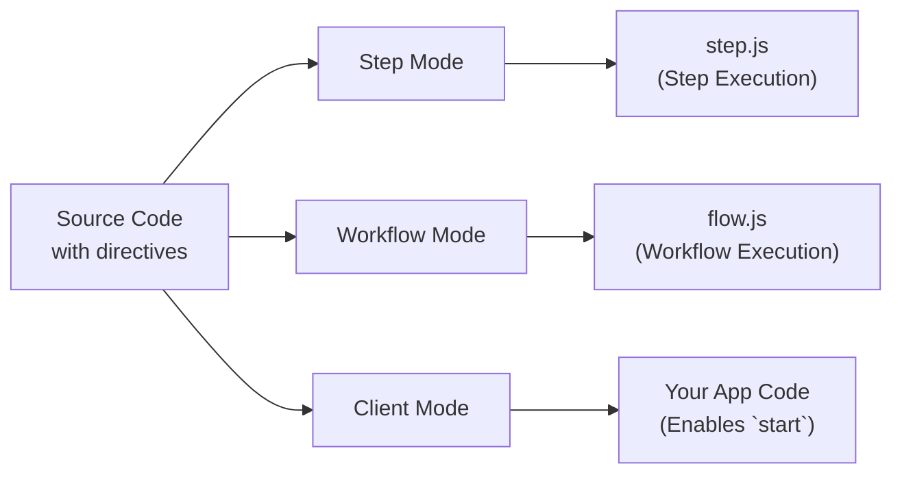

<Callout>
これは Workflow DevKit ディレクティブの内部に踏み込む上級ガイドで、ワークフローを利用するために必読というわけではありません。Workflow DevKit を単に使用するだけなら、お使いのフレームワーク向けの[はじめに](/docs/getting-started)ガイドを参照してください。
</Callout>

ワークフローは、Workflow DevKit コンパイラによる変換対象としてコードをマークするために特殊なディレクティブを使用します。このページでは "use workflow" と "use step" ディレクティブがどのように機能するか、どんな変換が適用されるか、そして耐久実行にそれらがなぜ必要かを説明します。

## ディレクティブの概要

ワークフローは特別な処理を行うために関数をマークするために2つのディレクティブを使用します:

```typescript
export async function handleUserSignup(email: string) {
  "use workflow"; // [!code highlight]

  const user = await createUser(email);
  await sendWelcomeEmail(user);

  return { userId: user.id };
}

async function createUser(email: string) {
  "use step"; // [!code highlight]

  return { id: crypto.randomUUID(), email };
}
```

**主要なディレクティブ:**

- `"use workflow"`: 関数を耐久性のあるワークフローのエントリポイントとしてマークする
- `"use step"`: 関数をアトミックでリトライ可能なステップとしてマークする

これらのディレクティブは `@workflow/swc-plugin` コンパイラをトリガーし、実行コンテキストに応じてコードをさまざまに変換します。

## 3つの変換モード

コンパイラは3つの異なるモードで動作し、同じソースコードを実行コンテキストごとに異なる方法で変換します:



### 比較表

| Mode     | Used In    | Purpose                        | Output API Route                   | Required? |
|----------|------------|--------------------------------|------------------------------------|-----------|
| ステップ (Step)     | ビルド時    | ステップハンドラをバンドルする          | `.well-known/workflow/v1/step`  | 必須       |
| ワークフロー (Workflow) | ビルド時    | ワークフローのオーケストレーターをバンドルする | `.well-known/workflow/v1/flow`  | 必須       |
| クライアント (Client)   | ビルド/実行時 | `start` にワークフローIDと型情報を提供する   | アプリケーションコード              | 任意* |

\* クライアントモードは開発者体験を向上させるために**推奨**されます — 自動的なID生成と型安全性を提供します。クライアントモードを使わない場合は、ワークフローIDを手動で構築するか、ビルド時に生成されるマニフェストを使用する必要があります。

## 詳細な変換例

<Tabs items={["Step Mode", "Workflow Mode", "Client Mode"]}>
<Tab value="Step Mode">

**Step Mode** は `/.well-known/workflow/v1/step` で提供されるステップ実行バンドルを作成します。

**入力:**

```typescript
export async function createUser(email: string) {
  "use step";
  return { id: crypto.randomUUID(), email };
}
```

**出力:**

```typescript
import { registerStepFunction } from "workflow/internal/private"; // [!code highlight]

export async function createUser(email: string) {
  return { id: crypto.randomUUID(), email };
}

registerStepFunction("step//workflows/user.js//createUser", createUser); // [!code highlight]
```

**何が起きるか:**

- `"use step"` ディレクティブは削除される
- 関数本体は完全にそのまま保持される（変換は行われない）
- 関数はランタイムに `registerStepFunction()` を使って登録される
- ステップ関数は Node.js/Deno/Bun のフルアクセスで実行される

**なぜ変換が不要なのか?** ステップ関数はメインのランタイムで Node.js API、ファイルシステム、データベースなどに完全アクセスして実行されます。特別な扱いは不要で、通常通り実行されます。

**ID の形式:** ステップIDは `step//{filepath}//{functionName}` のパターンに従います。filepath はプロジェクトルートからの相対パスです。

</Tab>
<Tab value="Workflow Mode">

**Workflow Mode** は `/.well-known/workflow/v1/flow` で提供されるワークフロー実行バンドルを作成します。

**入力:**

```typescript
export async function createUser(email: string) {
  "use step";
  return { id: crypto.randomUUID(), email };
}

export async function handleUserSignup(email: string) {
  "use workflow";
  const user = await createUser(email);
  return { userId: user.id };
}
```

**出力:**

```typescript
export async function createUser(email: string) {
  return globalThis[Symbol.for("WORKFLOW_USE_STEP")]("step//workflows/user.js//createUser")(email); // [!code highlight]
}

export async function handleUserSignup(email: string) {
  const user = await createUser(email);
  return { userId: user.id };
}
handleUserSignup.workflowId = "workflow//workflows/user.js//handleUserSignup"; // [!code highlight]
```

**何が起きるか:**

- ステップ関数の本体は **置き換えられ**、`globalThis[Symbol.for("WORKFLOW_USE_STEP")]` への呼び出しに変わる
- ワークフロー関数の本体は **そのまま保持** される — リプレイ時に決定的に実行される
- ワークフロー関数にはランタイム識別のために `workflowId` プロパティが付与される
- `"use workflow"` ディレクティブは削除される

**なぜこの変換なのか?** ワークフロー実行時には、過去のステップをイベントログからリプレイする必要があり、再実行するのでは不適切な場合があります。`WORKFLOW_USE_STEP` シンボルは特殊なランタイムフックであり、次を行います:

1. ステップが既に実行済みか（イベントログにあるか）をチェックする
2. もし実行済みなら: キャッシュされた結果を返す
3. もし未実行なら: サスペンドを発生させ、バックグラウンドでステップをキューに入れる

**ID の形式:** ワークフローIDは `workflow//{filepath}//{functionName}` のパターンに従います。`workflowId` プロパティはランタイムで [`start()`](/docs/api-reference/workflow-api/start) が機能するよう関数に付与されます。

</Tab>
<Tab value="Client Mode">

**Client Mode** はアプリケーションコード内のワークフロー関数を直接実行されないよう変換します。

**入力:**

```typescript
export async function handleUserSignup(email: string) {
  "use workflow";
  const user = await createUser(email);
  return { userId: user.id };
}
```

**出力:**

```typescript
export async function handleUserSignup(email: string) {
  throw new Error("You attempted to execute ..."); // [!code highlight]
}
handleUserSignup.workflowId = "workflow//workflows/user.js//handleUserSignup"; // [!code highlight]
```

**何が起きるか:**

- ワークフロー関数の本体は **エラー投擲** に置き換えられる
- `workflowId` プロパティが追加される（ワークフローモードと同様）
- ステップ関数はクライアントモードでは変換されない

**なぜこの変換なのか?** ワークフロー関数は直接呼び出すことはできません — [`start()`](/docs/api-reference/workflow-api/start) を使って開始する必要があります。エラーは誤って直接実行されることを防ぎ、`workflowId` プロパティはどのワークフローを起動するかを `start()` が識別できるようにします。

ID はワークフローモードと同様に生成され、ランタイムで直接参照できるようになっています。

<Callout type="info">
  **クライアントモードは任意です:** 開発者体験（自動ID生成と型安全）を向上させるために推奨されますが、クライアントモードをスキップして次のいずれかを行うこともできます:
  - パターン `workflow//{filepath}//{functionName}` を使ってワークフローIDを手動で構築する
  - ビルド時に生成されるワークフローマニフェストファイルを使ってIDを検索する
  - ID を文字列として直接 `start()` に渡す

  すべてのフレームワーク統合はデフォルトでクライアントモードをローダとして含みます。
</Callout>

</Tab>
</Tabs>

## 生成されるファイル

アプリケーションをビルドすると、Workflow DevKit は `.well-known/workflow/v1/` に3つのハンドラファイルを生成します:

### `flow.js`

ワークフローモードで変換されたすべてのワークフロー関数を含みます。このファイルはフレームワークによってインポートされ、`POST /.well-known/workflow/v1/flow` でのワークフロー実行リクエストを処理します。

**構成:**

すべてのワークフローコードはまとめて `flow.js` の中に文字列として埋め込まれます。ワークフローを実行する必要があるとき、このバンドルされたコードは **Node.js VM**（仮想マシン）内で実行され、次を保証します:

- **決定性**: 同じ入力は常に同じ出力を生成する
- **副作用の防止**: Node.js API、ファイルシステム、ネットワークなどへの直接アクセスはブロックされる
- **サンドボックス化された実行**: ワークフローのオーケストレーションロジックはメインランタイムから隔離される

**ビルド時バリデーション:**

ワークフローモードの変換はビルド時にコードを検証します:

- `fs`, `http`, `child_process` などの無効な Node.js API 使用を検出する
- 決定性を壊すモジュールのインポートを防ぐ

ほとんどの無効なパターンは **ビルド時エラー** を引き起こし、デプロイ前に問題を検出します。

**機能:**

- Web 標準の `Request` オブジェクトを受け取る `POST` ハンドラをエクスポートする
- 各リクエストごとにバンドルされたワークフローコードを Node.js VM 内で実行する
- ワークフローの実行、リプレイ、および再開を処理する
- オーケストレーション層に実行結果を返す

<Callout type="info">
  **なぜ VM を使うのか?** ワークフロー関数はリプレイをサポートするために決定的である必要があります。VM サンドボックスは非決定的な API や副作用の誤使用を防ぎます。すべての副作用は [ステップ関数](/docs/foundations/workflows-and-steps#step-functions) で実行すべきです。
</Callout>

### `step.js`

ステップモードで変換されたすべてのステップ関数を含みます。このファイルはフレームワークによってインポートされ、`POST /.well-known/workflow/v1/step` でのステップ実行リクエストを処理します。

**機能:**

- Web 標準の `Request` オブジェクトを受け取る `POST` ハンドラをエクスポートする
- 個々のステップをフルランタイムアクセスで実行する
- ステップ結果をオーケストレーション層に返す

### `webhook.js`

[`createWebhook()`](/docs/api-reference/workflow/create-webhook) を介して実行中のワークフローに外部データを届けるための webhook 処理ロジックを含みます。

**機能:**

- webhook ペイロードを受け取る `POST` ハンドラをエクスポートする
- トークンを検証し、正しいワークフロー実行にデータをルーティングする
- webhook 配信後にワークフロー実行を再開する

**注意:** webhook ファイルの構造はフレームワークによって異なります。Next.js は App Router の動的ルーティングを活用するために `webhook/[token]/route.js` を生成しますが、他のフレームワークは単一の `webhook.js` または `webhook.mjs` ハンドラを生成します。

## なぜ三つのモードなのか?

マルチモード変換は Workflow DevKit の耐久実行モデルを可能にします:

1. **ステップモード**（必須） - フルランタイムアクセスを持つ実行可能なステップ関数をバンドルする
2. **ワークフローモード**（必須） - イベントログからリプレイできるオーケストレーションロジックを作成する
3. **クライアントモード**（任意） - 直接実行を防ぎ、型安全なワークフロー参照を可能にする

この分離により次が可能になります:

- **決定的なリプレイ**: ワークフローは副作用を再実行せずにイベントログから安全にリプレイできる
- **サンドボックス化されたオーケストレーション**: ワークフローのロジックは制御された VM 内で実行され、直接ランタイムアクセスはできない
- **ステートレスな実行**: コンピュートはゼロスケールまでスケールダウンでき、ワークフローの任意の地点から再開できる
- **型安全性**: クライアントモードを使用することで TypeScript がワークフロー参照とシームレスに連携する

## 決定性とリプレイ

変換の重要な側面は、ワークフロー関数の **決定的なリプレイ** を維持することです。

**ワークフロー関数は決定的でなければなりません:**

- 同じ入力は常に同じ出力を生成する
- 直接的な副作用を行わない（外部API呼び出し、データベース書き込み、ファイルI/O などを行わない）
- VM が提供するシードされた乱数/時間 API（`Math.random()`, `Date.now()` など）を利用できる

ワークフロー関数は決定的で副作用がないため、複数回安全に再実行して次にどのステップを実行すべきかを計算できます。これがワークフローモードで関数本体がそのまま保持される理由です — それらは純粋なオーケストレーションロジックです。

**ステップ関数は非決定的で構いません:**

- API 呼び出し、データベースクエリなどを行える
- Node.js ランタイムと API へのフルアクセスを持つ
- 結果は最初の実行後にイベントログにキャッシュされる

詳細は [ワークフローとステップ](/docs/foundations/workflows-and-steps) を参照してください。

## ID の生成

コンパイラはファイルパスと関数名に基づいてワークフローとステップの安定したIDを生成します:

**パターン:** `{type}//{filepath}//{functionName}`

**例:**

- `workflow//workflows/user-signup.js//handleUserSignup`
- `step//workflows/user-signup.js//createUser`
- `step//workflows/payments/checkout.ts//processPayment`

**主要な特性:**

- **安定している**: ファイルや関数の名前を変更しない限り ID は変わらない
- **一意**: 各ワークフロー/ステップには固有の識別子がある
- **移植可能**: 異なるランタイムやデプロイ環境間でも機能する

<Callout type="info">
  ファイルが移動されたり関数名が変更された場合、ID は変わる可能性がありますが、Workflow DevKit は世界的にアトミックなバージョニングを想定しています。つまり、ID を変更しても古いワークフローの実行が停止することはありませんが、実行のアップグレードはできなくなり、オブザーバビリティ上でワークフロー/ステップ名がデプロイ間で変化することになります。
</Callout>

## フレームワーク統合

これらの変換はフレームワーク非依存です — 標準的な JavaScript を出力するためどこでも動作します。

**ユーザー向け**: お使いのフレームワークがすべての変換を自動的に処理します。フレームワーク向けの[はじめに](/docs/getting-started)ガイドを参照してください。

**フレームワーク作者向け**: これらの変換をフレームワークに統合する方法は [フレームワーク統合の構築](/docs/how-it-works/framework-integrations) を参照してください。

## 変換後のコードのデバッグ

変換の問題をデバッグする必要がある場合、生成ファイルを調査できます:

1. **`.well-known/workflow/v1/` を確認する**: 生成された `flow.js`、`step.js`、`webhook.js` およびその他の出力されたデバッグファイルを確認する
2. **ビルドログを確認する**: ほとんどのフレームワークはビルド中に変換アクティビティをログに記録する
3. **ディレクティブを検証する**: `"use workflow"` と `"use step"` が関数内の最初のステートメントであることを確認する
4. **ファイルの配置を確認する**: 変換は設定されたソースディレクトリ内のファイルにのみ適用される
