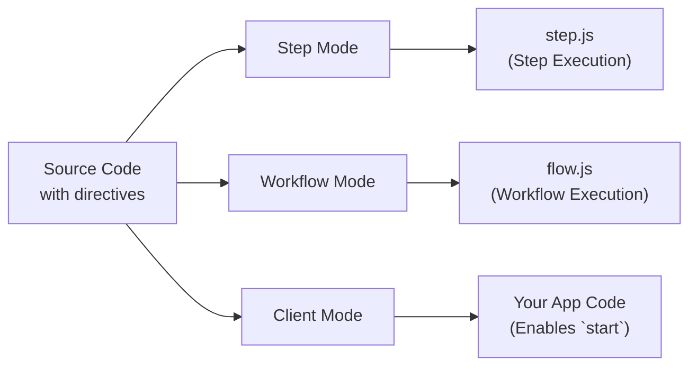

<Callout>
Este é um guia avançado que aprofunda os internos da diretiva do Workflow DevKit e não é leitura obrigatória para usar workflows. Para simplesmente usar o Workflow DevKit, consulte os guias de [início rápido](/docs/getting-started) para o seu framework.
</Callout>

Workflows usam diretivas especiais para marcar código para transformação pelo compilador do Workflow DevKit. Esta página explica como as diretivas `"use workflow"` e `"use step"` funcionam, quais transformações são aplicadas e por que elas são necessárias para execução durável.

## Visão Geral das Diretivas

Workflows usam duas diretivas para marcar funções para tratamento especial:

```typescript
export async function handleUserSignup(email: string) {
  "use workflow"; // [!code highlight]

  const user = await createUser(email);
  await sendWelcomeEmail(user);

  return { userId: user.id };
}

async function createUser(email: string) {
  "use step"; // [!code highlight]

  return { id: crypto.randomUUID(), email };
}
```

**Diretivas principais:**

- `"use workflow"`: Marca uma função como ponto de entrada de workflow durável
- `"use step"`: Marca uma função como uma etapa atômica e reexecutável

Essas diretivas acionam o compilador `@workflow/swc-plugin` para transformar seu código de maneiras diferentes dependendo do contexto de execução.

## Os Três Modos de Transformação

O compilador opera em três modos distintos, transformando o mesmo código-fonte de forma diferente para cada contexto de execução:



### Tabela de Comparação

| Modo     | Usado em    | Finalidade                        | Rota da API de Saída                   | Necessário? |
|----------|------------|-----------------------------------|----------------------------------------|-------------|
| Step     | Tempo de build | Agrupa manipuladores de step     | `.well-known/workflow/v1/step`         | Sim         |
| Workflow | Tempo de build | Agrupa orquestradores de workflow | `.well-known/workflow/v1/flow`         | Sim         |
| Client   | Build/Runtime | Fornece IDs de workflow e tipos para `start` | Seu código de aplicação                | Opcional*   |

\* O modo Client é **recomendado** para melhor experiência de desenvolvedor — ele fornece geração automática de IDs e segurança de tipos. Sem ele, você deve construir IDs de workflow manualmente ou usar o manifesto de build.

## Exemplos Detalhados de Transformação

<Tabs items={["Modo Step", "Modo Workflow", "Modo Cliente"]}>
<Tab value="Modo Step">

**Modo Step** cria o bundle de execução de step servido em `/.well-known/workflow/v1/step`.

**Entrada:**

```typescript
export async function createUser(email: string) {
  "use step";
  return { id: crypto.randomUUID(), email };
}
```

**Saída:**

```typescript
import { registerStepFunction } from "workflow/internal/private"; // [!code highlight]

export async function createUser(email: string) {
  return { id: crypto.randomUUID(), email };
}

registerStepFunction("step//workflows/user.js//createUser", createUser); // [!code highlight]
```

**O que acontece:**

- A diretiva `"use step"` é removida
- O corpo da função é mantido completamente intacto (sem transformação)
- A função é registrada no runtime usando `registerStepFunction()`
- Funções de step executam com acesso completo ao Node.js/Deno/Bun

**Por que nenhuma transformação?** Funções de step executam no seu runtime principal com acesso completo às APIs do Node.js, sistema de arquivos, bancos de dados, etc. Elas não precisam de tratamento especial — apenas executam normalmente.

**Formato de ID:** IDs de step seguem o padrão `step//{filepath}//{functionName}`, onde o filepath é relativo à raiz do seu projeto.

</Tab>
<Tab value="Modo Workflow">

**Modo Workflow** cria o bundle de execução de workflow servido em `/.well-known/workflow/v1/flow`.

**Entrada:**

```typescript
export async function createUser(email: string) {
  "use step";
  return { id: crypto.randomUUID(), email };
}

export async function handleUserSignup(email: string) {
  "use workflow";
  const user = await createUser(email);
  return { userId: user.id };
}
```

**Saída:**

```typescript
export async function createUser(email: string) {
  return globalThis[Symbol.for("WORKFLOW_USE_STEP")]("step//workflows/user.js//createUser")(email); // [!code highlight]
}

export async function handleUserSignup(email: string) {
  const user = await createUser(email);
  return { userId: user.id };
}
handleUserSignup.workflowId = "workflow//workflows/user.js//handleUserSignup"; // [!code highlight]
```

**O que acontece:**

- Os corpos das funções de step são **substituídos** por chamadas a `globalThis[Symbol.for("WORKFLOW_USE_STEP")]`
- Os corpos das funções de workflow permanecem **intactos** — eles executam de forma determinística durante o replay
- A função de workflow recebe uma propriedade `workflowId` para identificação em runtime
- A diretiva `"use workflow"` é removida

**Por que essa transformação?** Quando um workflow executa, é necessário reexecutar (replay) passos a partir do log de eventos em vez de reexecutá-los de fato. O símbolo `WORKFLOW_USE_STEP` é um gancho especial em runtime que:

1. Verifica se o step já foi executado (no log de eventos)
2. Se sim: Retorna o resultado em cache
3. Se não: Aciona uma suspensão e enfileira o step para execução em segundo plano

**Formato de ID:** IDs de workflow seguem o padrão `workflow//{filepath}//{functionName}`. A propriedade `workflowId` é anexada à função para permitir que [`start()`](/docs/api-reference/workflow-api/start) funcione em runtime.

</Tab>
<Tab value="Modo Cliente">

**Modo Cliente** transforma funções de workflow no código da sua aplicação para impedir execução direta.

**Entrada:**

```typescript
export async function handleUserSignup(email: string) {
  "use workflow";
  const user = await createUser(email);
  return { userId: user.id };
}
```

**Saída:**

```typescript
export async function handleUserSignup(email: string) {
  throw new Error("You attempted to execute ..."); // [!code highlight]
}
handleUserSignup.workflowId = "workflow//workflows/user.js//handleUserSignup"; // [!code highlight]
```

**O que acontece:**

- Os corpos das funções de workflow são **substituídos** por um lançamento de erro
- A propriedade `workflowId` é adicionada (igual ao modo workflow)
- Funções de step não são transformadas no modo cliente

**Por que essa transformação?** Funções de workflow não podem ser chamadas diretamente — elas devem ser iniciadas usando [`start()`](/docs/api-reference/workflow-api/start). O erro previne execução direta acidental enquanto a propriedade `workflowId` permite que a função `start()` identifique qual workflow lançar.

Os IDs são gerados exatamente como no modo workflow para garantir que possam ser referenciados diretamente em runtime.

<Callout type="info">
  **O modo cliente é opcional:** Embora recomendado para melhor experiência de desenvolvedor (IDs automáticos e segurança de tipos), você pode pular o modo cliente e em vez disso:
  - Construir IDs de workflow manualmente usando o padrão `workflow//{filepath}//{functionName}`
  - Usar o arquivo de manifesto de workflow gerado durante o build para procurar IDs
  - Passar IDs diretamente para `start()` como strings

  Todas as integrações de framework incluem o modo cliente como um loader por padrão.
</Callout>

</Tab>
</Tabs>

## Arquivos Gerados

Quando você builda sua aplicação, o Workflow DevKit gera três arquivos de manipulador em `.well-known/workflow/v1/`:

### `flow.js`

Contém todas as funções de workflow transformadas em **modo workflow**. Este arquivo é importado pelo seu framework para lidar com requisições de execução de workflow em `POST /.well-known/workflow/v1/flow`.

**Como é estruturado:**

Todo o código de workflow é empacotado junto e embutido como uma string dentro de `flow.js`. Quando um workflow precisa executar, esse código empacotado é executado dentro de uma **VM Node.js** (máquina virtual) para garantir:

- **Determinismo**: As mesmas entradas sempre produzem as mesmas saídas
- **Prevenção de efeitos colaterais**: O acesso direto às APIs do Node.js, sistema de arquivos, rede, etc. é bloqueado
- **Execução em sandbox**: A lógica de orquestração do workflow fica isolada do runtime principal

**Validação em tempo de build:**

A transformação em modo workflow valida seu código durante o build:

- Detecta uso inválido de APIs do Node.js (como `fs`, `http`, `child_process`)
- Previne imports de módulos que quebrariam o determinismo

A maioria dos padrões inválidos causa **erros em tempo de build**, capturando problemas antes do deploy.

**O que ele faz:**

- Exporta um manipulador `POST` que aceita objetos `Request` padrão da Web
- Executa o código de workflow empacotado dentro de uma VM Node.js para cada requisição
- Lida com execução de workflow, replay e retomada
- Retorna resultados de execução para a camada de orquestração

<Callout type="info">
  **Por que uma VM?** Funções de workflow precisam ser determinísticas para suportar replay. O sandbox da VM previne uso acidental de APIs não determinísticas ou efeitos colaterais. Todos os efeitos colaterais devem ser realizados em [funções step](/docs/foundations/workflows-and-steps#step-functions).
</Callout>

### `step.js`

Contém todas as funções de step transformadas em **modo step**. Este arquivo é importado pelo seu framework para lidar com requisições de execução de step em `POST /.well-known/workflow/v1/step`.

**O que ele faz:**

- Exporta um manipulador `POST` que aceita objetos `Request` padrão da Web
- Executa steps individuais com acesso completo ao runtime
- Retorna resultados de step para a camada de orquestração

### `webhook.js`

Contém a lógica de tratamento de webhooks para entregar dados externos a workflows em execução via [`createWebhook()`](/docs/api-reference/workflow/create-webhook).

**O que ele faz:**

- Exporta um manipulador `POST` que aceita payloads de webhook
- Valida tokens e roteia dados para a execução correta do workflow
- Retoma a execução do workflow após a entrega do webhook

**Observação:** A estrutura do arquivo de webhook varia conforme o framework. Next.js gera `webhook/[token]/route.js` para aproveitar o roteamento dinâmico do App Router, enquanto outros frameworks geram um único `webhook.js` ou `webhook.mjs`.

## Por que Três Modos?

A transformação multi-modo possibilita o modelo de execução durável do Workflow DevKit:

1. **Modo Step** (obrigatório) - Empacota funções de step executáveis que podem acessar o runtime completo
2. **Modo Workflow** (obrigatório) - Cria lógica de orquestração que pode ser reexecutada a partir dos logs de evento
3. **Modo Cliente** (opcional) - Previne execução direta e habilita referências de workflow com segurança de tipos

Essa separação permite:

- **Replay determinístico**: Workflows podem ser reexecutados com segurança a partir dos logs de evento sem reexecutar efeitos colaterais
- **Orquestração em sandbox**: A lógica de workflow roda em uma VM controlada sem acesso direto ao runtime
- **Execução sem estado**: Seu compute pode escalar a zero e retomar de qualquer ponto no workflow
- **Segurança de tipos**: TypeScript funciona de forma integrada com referências de workflow (quando se usa o modo cliente)

## Determinismo e Replay

Um aspecto chave da transformação é manter o **replay determinístico** para funções de workflow.

**Funções de workflow devem ser determinísticas:**

- As mesmas entradas sempre produzem as mesmas saídas
- Sem efeitos colaterais diretos (sem chamadas de API, sem gravações em banco de dados, sem I/O de arquivos)
- Podem usar APIs de tempo/aleatoriedade sem estado fornecidas pela VM (`Math.random()`, `Date.now()`, etc.)

Como funções de workflow são determinísticas e não têm efeitos colaterais, elas podem ser reexecutadas com segurança várias vezes para calcular qual deve ser o próximo passo. É por isso que os corpos das funções de workflow permanecem intactos no modo workflow — eles são pura lógica de orquestração.

**Funções de step podem ser não determinísticas:**

- Podem fazer chamadas de API, consultas a banco de dados, etc.
- Têm acesso completo ao runtime e às APIs do Node.js
- Resultados são armazenados em cache no log de eventos após a primeira execução

Saiba mais sobre [Workflows and Steps](/docs/foundations/workflows-and-steps).

## Geração de IDs

O compilador gera IDs estáveis para workflows e steps com base em caminhos de arquivos e nomes de funções:

**Padrão:** `{type}//{filepath}//{functionName}`

**Exemplos:**

- `workflow//workflows/user-signup.js//handleUserSignup`
- `step//workflows/user-signup.js//createUser`
- `step//workflows/payments/checkout.ts//processPayment`

**Propriedades chave:**

- **Estável**: IDs não mudam a menos que você renomeie arquivos ou funções
- **Único**: Cada workflow/step tem um identificador único
- **Portável**: Funciona em diferentes runtimes e implantações

<Callout type="info">
  Embora os IDs possam mudar quando arquivos são movidos ou funções são renomeadas, o Workflow DevKit assume versionamento atômico no mundo. Isso significa que alterar IDs não impedirá a execução de workflows antigos, mas impedirá que runs sejam atualizados e fará com que os nomes do workflow/step mudem na observabilidade entre implantações.
</Callout>

## Integração com Frameworks

Essas transformações são agnósticas ao framework — elas geram JavaScript padrão que funciona em qualquer lugar.

**Para usuários**: Seu framework trata todas as transformações automaticamente. Veja o guia de [Início Rápido](/docs/getting-started) para o seu framework.

**Para autores de framework**: Aprenda como integrar essas transformações ao seu framework em [Construindo Integrações de Framework](/docs/how-it-works/framework-integrations).

## Depuração do Código Transformado

Se você precisar depurar problemas de transformação, pode inspecionar os arquivos gerados:

1. **Procure em `.well-known/workflow/v1/`**: Verifique os arquivos gerados `flow.js`, `step.js`, `webhook.js` e outros arquivos de debug emitidos.
2. **Verifique logs de build**: A maioria dos frameworks registra atividade de transformação durante os builds
3. **Verifique as diretivas**: Garanta que `"use workflow"` e `"use step"` sejam as primeiras declarações nas funções
4. **Cheque locais de arquivos**: Transformações só se aplicam a arquivos em diretórios de origem configurados