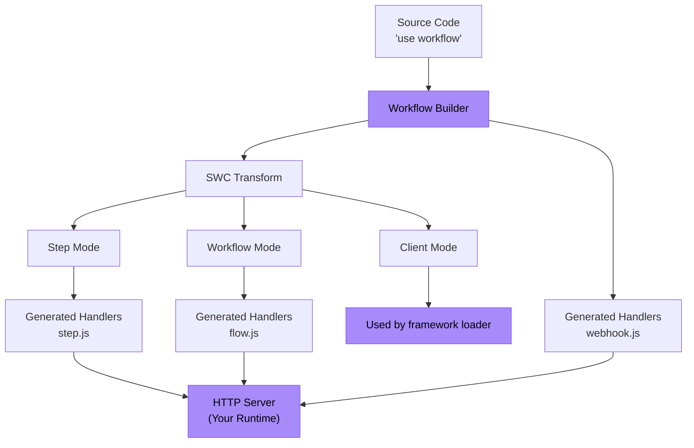

<Callout>
  **对于用户：** 如果您只是想在现有框架中使用 Workflow DevKit，请改为查看 [入门](/docs/getting-started) 指南。此页面面向希望将 Workflow DevKit 与其框架或运行时集成的框架作者。
</Callout>

本指南将引导您使用 Bun 作为具体示例构建 Workflow DevKit 的框架集成。相同的原理适用于任何 JavaScript 运行时（Node.js、Deno、Cloudflare Workers 等）。

<Callout type="info">
  **先决条件：** 在构建框架集成之前，我们建议阅读 [指令如何工作](/docs/how-it-works/code-transform)，以了解驱动 Workflow DevKit 的转换系统。
</Callout>

## 您将构建的内容

一个框架集成包含两个主要部分：

1. **构建时**：生成工作流处理程序文件（`flow.js`、`step.js`、`webhook.js`）
2. **运行时**：在您的应用服务器中将这些处理程序作为 HTTP 端点暴露



紫色方框是您需要实现的部分——其余由 Workflow DevKit 提供。

## 示例：Bun 集成

让我们为 Bun 构建一个完整的集成。Bun 独特之处在于它既作为运行时（需要代码转换），又作为框架（提供 `Bun.serve()` 进行 HTTP 路由）。

<Callout type="info">
  可以在 [此处](https://github.com/vercel/workflow-examples/tree/main/custom-adapter) 找到一个可运行的示例。有关生产就绪的参考，请参阅 [Next.js 集成](https://github.com/vercel/workflow/tree/main/packages/next)。
</Callout>

### 步骤 1：生成处理程序文件

使用 `workflow` CLI 生成处理程序捆绑包。CLI 会扫描您的 `workflows/` 目录并创建 `flow.js`、`step.js` 和 `webhook.js`。

```json title="package.json"
{
  "scripts": {
    "dev": "bun x workflow build && PORT=3152 bun run server.ts"
  }
}
```

<Callout>
  **对于生产集成：** 与其使用 CLI，不如在您的框架插件中直接扩展 `BaseBuilder` 类。这将使您能够控制文件监听、自定义输出路径以及框架特定的钩子。示例请参阅 [Next.js 插件](https://github.com/vercel/workflow/tree/main/packages/next)。
</Callout>

**生成的内容：**

- `/.well-known/workflow/v1/flow.js` - 处理工作流执行（workflow 模式转换）
- `/.well-known/workflow/v1/step.js` - 处理步骤执行（step 模式转换）
- `/.well-known/workflow/v1/webhook.js` - 处理 webhook 传递

每个文件都导出一个接受 Web 标准 `Request` 对象的 `POST` 函数。

### 步骤 2：添加客户端模式转换（可选）

客户端模式会转换您的应用代码以提供更好的开发者体验（DX）。添加一个 Bun 插件以在运行时应用此转换：

```typescript title="workflow-plugin.ts" lineNumbers
import { plugin } from "bun";
import { transform } from "@swc/core";

plugin({
  name: "workflow-transform",
  setup(build) {
    build.onLoad({ filter: /\.(ts|tsx|js|jsx)$/ }, async (args) => {
      const source = await Bun.file(args.path).text();

      // Optimization: Skip files that do not have any directives
      if (!source.match(/(use step|use workflow)/)) {
        return { contents: source };
      }

      const result = await transform(source, {
        filename: args.path,
        jsc: {
          experimental: {
            plugins: [
              [require.resolve("@workflow/swc-plugin"), { mode: "client" }], // [!code highlight]
            ],
          },
        },
      });

      return { contents: result.code, loader: "ts" };
    });
  },
});
```

在 `bunfig.toml` 中激活该插件：

```toml title="bunfig.toml"
preload = ["./workflow-plugin.ts"]
```

**这会做什么：**

- 将 workflow ID 附加到函数，以供 `start()` 使用
- 提供 TypeScript 类型安全
- 防止工作流被意外直接执行

**为什么是可选的？** 如果不使用客户端模式，您仍然可以通过手动构造 ID 或引用构建清单来使用工作流。

### 步骤 3：暴露 HTTP 端点

使用 `Bun.serve()` 将生成的处理程序绑定到 HTTP 端点：

```typescript title="server.ts" lineNumbers
import flow from "./.well-known/workflow/v1/flow.js";
import step from "./.well-known/workflow/v1/step.js";
import * as webhook from "./.well-known/workflow/v1/webhook.js";

import { start } from "workflow/api";
import { handleUserSignup } from "./workflows/user-signup.js";

const server = Bun.serve({
  port: process.env.PORT,
  routes: {
    "/.well-known/workflow/v1/flow": {
      POST: (req) => flow.POST(req),
    },
    "/.well-known/workflow/v1/step": {
      POST: (req) => step.POST(req),
    },
    // webhook exports handlers for GET, POST, DELETE, etc.
    "/.well-known/workflow/v1/webhook/:token": webhook,

    // Example: Start a workflow
    "/": {
      GET: async (req) => {
        const email = `test-${crypto.randomUUID()}@test.com`;
        const run = await start(handleUserSignup, [email]);
        return Response.json({
          message: "User signup workflow started",
          runId: run.runId,
        });
      },
    },
  },
});

console.log(`Server listening on http://localhost:${server.port}`);
```

**就是这样！** 您的 Bun 集成已完成。

## 理解端点

您的集成必须暴露三个 HTTP 端点。生成的处理程序会管理所有协议细节——您只需进行路由。

### 工作流端点

**Route：** `POST /.well-known/workflow/v1/flow`

执行工作流编排逻辑。工作流函数在执行过程中会被“渲染”多次——每次推进直到遇到下一个步骤。

**在以下情况下调用：**

- 启动新的工作流
- 步骤完成后恢复执行
- webhook 或钩子触发后恢复执行
- 从失败中恢复

### 步骤端点

**Route：** `POST /.well-known/workflow/v1/step`

执行工作流内的单个原子操作。每个步骤在一次执行中仅运行一次（除非因失败重试）。步骤具有完整的运行时访问权限（Node.js API、文件系统、数据库等）。

### Webhook 端点

**Route：** `POST /.well-known/workflow/v1/webhook/:token`

通过 [`createWebhook()`](/docs/api-reference/workflow/create-webhook) 将 webhook 数据传递给正在运行的工作流。`:token` 参数用于标识应接收数据的工作流运行。

<Callout type="info">
  webhook 文件结构因框架而异。Next.js 会生成 `webhook/[token]/route.js` 以利用 App Router 的动态路由，而其他框架则生成单个 `webhook.js` 处理程序。
</Callout>

## 适配其他框架

Bun 示例演示了核心模式。要适配到您的框架：

### 构建时

**选项 1：使用 CLI**（最简单）

```bash
workflow build
```

这将默认扫描顶级目录 `./workflows` 中的工作流文件，并将打包文件直接输出到您的工作目录。

**选项 2：扩展 `BaseBuilder`**（推荐）

```typescript lineNumbers
import { BaseBuilder } from "@workflow/cli/dist/lib/builders/base-builder";

class MyFrameworkBuilder extends BaseBuilder {
  constructor(options) {
    super({
      dirs: ["workflows"],
      workingDir: options.rootDir,
      watch: options.dev,
    });
  }

  override async build(): Promise<void> {
    const inputFiles = await this.getInputFiles();

    await this.createWorkflowsBundle({
      outfile: "/path/to/.well-known/workflow/v1/flow.js",
      format: "esm",
      inputFiles,
    });

    await this.createStepsBundle({
      outfile: "/path/to/.well-known/workflow/v1/step.js",
      format: "esm",
      inputFiles,
    });

    await this.createWebhookBundle({
      outfile: "/path/to/.well-known/workflow/v1/webhook.js",
    });
  }
}
```

如果您的框架支持虚拟服务器路由和开发模式下的监听，请相应地进行适配。如果基础构建器类缺少必要功能，请向 Workflow DevKit 提交 PR。

将其钩入您的框架构建流程：

```typescript title="pseudocode.ts" lineNumbers
framework.hooks.hook("build:before", async () => {
  await new MyFrameworkBuilder(framework).build();
});
```

### 运行时（客户端模式）

为您的打包器添加 loader/插件：

**Rollup/Vite：**

```typescript lineNumbers
export function workflowPlugin() {
  return {
    name: "workflow-client-transform",
    async transform(code, id) {
      if (!code.match(/(use step|use workflow)/)) return null;

      const result = await transform(code, {
        filename: id,
        jsc: {
          experimental: {
            plugins: [[require.resolve("@workflow/swc-plugin"), { mode: "client" }]], // [!code highlight]
          },
        },
      });

      return { code: result.code, map: result.map };
    },
  };
}
```

**Webpack：**

```javascript lineNumbers
module.exports = {
  module: {
    rules: [
      {
        test: /\.(ts|tsx|js|jsx)$/,
        use: "workflow-client-loader", // Similar implementation
      },
    ],
  },
};
```

### HTTP 服务器

将这三个端点路由到生成的处理程序。具体实现取决于您框架的路由 API。

在上面的 bun 示例中，我们将路由留给了用户。基本上，用户需要提供如下路由：

```typescript title="server.ts" lineNumbers
import flow from "./.well-known/workflow/v1/flow.js";
import step from "./.well-known/workflow/v1/step.js";
import * as webhook from "./.well-known/workflow/v1/webhook.js";

// Expose the 3 generated routes
const server = Bun.serve({
  routes: {
    "/.well-known/workflow/v1/flow": {
      POST: (req) => flow.POST(req),
    },
    "/.well-known/workflow/v1/step": {
      POST: (req) => step.POST(req),
    },
    // webhook exports handlers for GET, POST, DELETE, etc.
    "/.well-known/workflow/v1/webhook/:token": webhook,
  },
});
```

生产环境的框架集成应在插件中处理此路由，而不是留给用户，这取决于每个框架的具体实现。请查看 Workflow DevKit 源代码，了解生产级框架实现的示例。未来，Workflow DevKit 将在 `.well-known/workflow` 命名空间下发出更多路由。

## 安全性

**这些 HTTP 端点如何被保护？**

安全性由您使用的 **world 抽象** 处理：

**Vercel (`@workflow/world-vercel`)：**

- Vercel Queue 将支持私有调用，使路由无法从公共互联网访问
- 处理程序只会接收到必须从 Vercel 后端检索的消息 ID
- 在没有有效的队列签发消息 ID 的情况下，不可能伪造自定义负载

**自定义实现：**

- 通过框架中间件实现身份验证
- 使用 API 密钥、JWT 验证或其他认证方案
- 网络级安全（VPC、私有网络、防火墙规则）
- 速率限制和请求验证

了解有关 [world 抽象](/docs/deploying/world) 的更多信息。

## 测试您的集成

### 1. 测试构建输出

创建一个测试工作流：

```typescript title="workflows/test.ts" lineNumbers
import { sleep, createWebhook } from "workflow";

export async function handleUserSignup(email: string) {
  "use workflow";

  const user = await createUser(email);
  await sendWelcomeEmail(user);

  await sleep("5s");

  const webhook = createWebhook();
  await sendOnboardingEmail(user, webhook.url);

  await webhook;
  console.log("Webhook Resolved");

  return { userId: user.id, status: "onboarded" };
}

async function createUser(email: string) {
  "use step";

  console.log(`Creating a new user with email: ${email}`);

  return { id: crypto.randomUUID(), email };
}

async function sendWelcomeEmail(user: { id: string; email: string }) {
  "use step";

  console.log(`Sending welcome email to user: ${user.id}`);
}

async function sendOnboardingEmail(user: { id: string; email: string }, callback: string) {
  "use step";

  console.log(`Sending onboarding email to user: ${user.id}`);

  console.log(`Click this link to resolve the webhook: ${callback}`);
}

```

运行构建并验证：

- `.well-known/workflow/v1/flow.js` 存在
- `.well-known/workflow/v1/step.js` 存在
- `.well-known/workflow/v1/webhook.js` 存在

### 2. 测试 HTTP 端点

启动服务器并验证路由响应：

```bash
curl -X POST http://localhost:3000/.well-known/workflow/v1/flow
curl -X POST http://localhost:3000/.well-known/workflow/v1/step
curl -X POST http://localhost:3000/.well-known/workflow/v1/webhook/test
```

（应该会有响应，但在没有认证/正确的工作流运行上下文下不会触发有意义的代码）

### 3. 端到端运行工作流

```typescript
import { start } from "workflow/api";
import { handleUserSignup } from "./workflows/test";

const run = await start(handleUserSignup, ["test@example.com"]);
console.log("Workflow started:", run.runId);
```