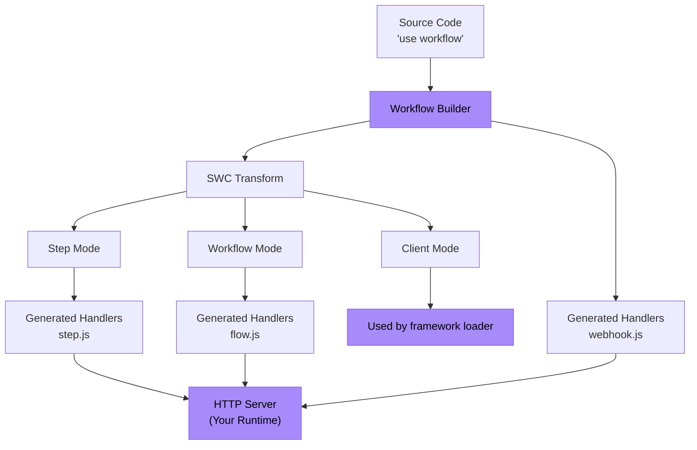

<Callout>
  **Para usuarios:** Si solo quieres usar Workflow DevKit con un framework existente, consulta la [Guía de inicio](/docs/getting-started) en su lugar. Esta página es para autores de frameworks que desean integrar Workflow DevKit con su framework o runtime.
</Callout>

Esta guía te explica cómo construir una integración de framework para Workflow DevKit usando Bun como ejemplo concreto. Los mismos principios se aplican a cualquier entorno de ejecución de JavaScript (Node.js, Deno, Cloudflare Workers, etc.).

<Callout type="info">
  **Requisitos previos:** Antes de construir una integración de framework, recomendamos leer [Cómo funcionan las directivas](/docs/how-it-works/code-transform) para entender el sistema de transformaciones que impulsa Workflow DevKit.
</Callout>

## Qué construirás

Una integración de framework tiene dos componentes principales:

1. **En tiempo de compilación**: Generar archivos manejadores de workflow (`flow.js`, `step.js`, `webhook.js`)
2. **Tiempo de ejecución**: Exponer estos manejadores como endpoints HTTP en el servidor de tu aplicación



Las cajas moradas son lo que implementas—todo lo demás lo proporciona Workflow DevKit.

## Ejemplo: Integración con Bun

Construyamos una integración completa para Bun. Bun es único porque actúa tanto como runtime (requiere transformaciones de código) como framework (proporciona `Bun.serve()` para el enrutamiento HTTP).

<Callout type="info">
  Un ejemplo funcional se puede [encontrar aquí](https://github.com/vercel/workflow-examples/tree/main/custom-adapter). Para una referencia lista para producción, consulta la [integración de Next.js](https://github.com/vercel/workflow/tree/main/packages/next).
</Callout>

### Paso 1: Generar archivos de manejadores

Usa la CLI `workflow` para generar los bundles de los manejadores. La CLI escanea tu directorio `workflows/` y crea `flow.js`, `step.js` y `webhook.js`.

```json title="package.json"
{
  "scripts": {
    "dev": "bun x workflow build && PORT=3152 bun run server.ts"
  }
}
```

<Callout>
  **Para integraciones de producción:** En lugar de usar la CLI, extiende la clase `BaseBuilder` directamente en el plugin de tu framework. Esto te da control sobre la vigilancia de archivos, rutas de salida personalizadas y hooks específicos del framework. Consulta el [plugin de Next.js](https://github.com/vercel/workflow/tree/main/packages/next) como ejemplo.
</Callout>

**Archivos generados:**

- `/.well-known/workflow/v1/flow.js` - Maneja la ejecución de flujos de trabajo (transformación en modo workflow)
- `/.well-known/workflow/v1/step.js` - Maneja la ejecución de pasos (transformación en modo step)
- `/.well-known/workflow/v1/webhook.js` - Maneja la entrega de webhooks

Cada archivo exporta una función `POST` que acepta objetos `Request` estándar de la Web.

### Paso 2: Agregar la transformación en modo cliente (opcional)

El modo cliente transforma el código de tu aplicación para ofrecer una mejor experiencia de desarrollador (DX). Agrega un plugin de Bun para aplicar esta transformación en tiempo de ejecución:

```typescript title="workflow-plugin.ts" lineNumbers
import { plugin } from "bun";
import { transform } from "@swc/core";

plugin({
  name: "workflow-transform",
  setup(build) {
    build.onLoad({ filter: /\.(ts|tsx|js|jsx)$/ }, async (args) => {
      const source = await Bun.file(args.path).text();

      // Optimization: Skip files that do not have any directives
      if (!source.match(/(use step|use workflow)/)) {
        return { contents: source };
      }

      const result = await transform(source, {
        filename: args.path,
        jsc: {
          experimental: {
            plugins: [
              [require.resolve("@workflow/swc-plugin"), { mode: "client" }], // [!code highlight]
            ],
          },
        },
      });

      return { contents: result.code, loader: "ts" };
    });
  },
});
```

Activa el plugin en `bunfig.toml`:

```toml title="bunfig.toml"
preload = ["./workflow-plugin.ts"]
```

**Qué hace esto:**

- Adjunta IDs de workflow a las funciones para usarlas con `start()`
- Proporciona seguridad de tipos de TypeScript
- Evita la ejecución directa accidental de workflows

**¿Por qué opcional?** Sin el modo cliente, aún puedes usar workflows construyendo manualmente los IDs o referenciando el manifiesto de build.

### Paso 3: Exponer endpoints HTTP

Conecta los manejadores generados a endpoints HTTP usando `Bun.serve()`:

```typescript title="server.ts" lineNumbers
import flow from "./.well-known/workflow/v1/flow.js";
import step from "./.well-known/workflow/v1/step.js";
import * as webhook from "./.well-known/workflow/v1/webhook.js";

import { start } from "workflow/api";
import { handleUserSignup } from "./workflows/user-signup.js";

const server = Bun.serve({
  port: process.env.PORT,
  routes: {
    "/.well-known/workflow/v1/flow": {
      POST: (req) => flow.POST(req),
    },
    "/.well-known/workflow/v1/step": {
      POST: (req) => step.POST(req),
    },
    // webhook exports handlers for GET, POST, DELETE, etc.
    "/.well-known/workflow/v1/webhook/:token": webhook,

    // Example: Start a workflow
    "/": {
      GET: async (req) => {
        const email = `test-${crypto.randomUUID()}@test.com`;
        const run = await start(handleUserSignup, [email]);
        return Response.json({
          message: "User signup workflow started",
          runId: run.runId,
        });
      },
    },
  },
});

console.log(`Server listening on http://localhost:${server.port}`);
```

**¡Eso es todo!** Tu integración con Bun está completa.

## Comprender los endpoints

Tu integración debe exponer tres endpoints HTTP. Los manejadores generados administran todos los detalles del protocolo: solo tienes que enrutar las solicitudes.

### Endpoint de Workflow

**Ruta:** `POST /.well-known/workflow/v1/flow`

Ejecuta la lógica de orquestación del flujo de trabajo. La función del workflow se "renderiza" múltiples veces durante la ejecución: cada vez progresa hasta que encuentra el siguiente paso.

**Se invoca cuando:**

- Se inicia un nuevo workflow
- Se reanuda después de que un paso se complete
- Se reanuda después de que un webhook o hook se dispare
- Se recupera de fallos

### Endpoint de Step

**Ruta:** `POST /.well-known/workflow/v1/step`

Ejecuta operaciones atómicas individuales dentro de los workflows. Cada paso se ejecuta exactamente una vez por ejecución (a menos que se reintente por fallos). Los pasos tienen acceso completo al runtime (APIs de Node.js, sistema de archivos, bases de datos, etc.).

### Endpoint de Webhook

**Ruta:** `POST /.well-known/workflow/v1/webhook/:token`

Entrega datos de webhook a workflows en ejecución vía [`createWebhook()`](/docs/api-reference/workflow/create-webhook). El parámetro `:token` identifica qué ejecución de workflow debe recibir los datos.

<Callout type="info">
  La estructura del archivo de webhook varía según el framework. Next.js genera `webhook/[token]/route.js` para aprovechar el enrutamiento dinámico del App Router, mientras que otros frameworks generan un único manejador `webhook.js`.
</Callout>

## Adaptación a otros frameworks

El ejemplo de Bun demuestra el patrón básico. Para adaptar a tu framework:

### En tiempo de compilación

**Opción 1: Usar la CLI** (la más simple)

```bash
workflow build
```

Esto por defecto escaneará el directorio de nivel superior `./workflows` en busca de archivos de workflow y generará los archivos bundle directamente en tu directorio de trabajo.

**Opción 2: Extender `BaseBuilder`** (recomendado)

```typescript lineNumbers
import { BaseBuilder } from "@workflow/cli/dist/lib/builders/base-builder";

class MyFrameworkBuilder extends BaseBuilder {
  constructor(options) {
    super({
      dirs: ["workflows"],
      workingDir: options.rootDir,
      watch: options.dev,
    });
  }

  override async build(): Promise<void> {
    const inputFiles = await this.getInputFiles();

    await this.createWorkflowsBundle({
      outfile: "/path/to/.well-known/workflow/v1/flow.js",
      format: "esm",
      inputFiles,
    });

    await this.createStepsBundle({
      outfile: "/path/to/.well-known/workflow/v1/step.js",
      format: "esm",
      inputFiles,
    });

    await this.createWebhookBundle({
      outfile: "/path/to/.well-known/workflow/v1/webhook.js",
    });
  }
}
```

Si tu framework soporta rutas de servidor virtuales y vigilancia en modo dev, asegúrate de adaptarlo en consecuencia. Por favor, abre un PR al Workflow DevKit si la clase base builder no dispone de la funcionalidad necesaria.

Engancha esto en el proceso de build de tu framework:

```typescript title="pseudocode.ts" lineNumbers
framework.hooks.hook("build:before", async () => {
  await new MyFrameworkBuilder(framework).build();
});
```

### Tiempo de ejecución (modo cliente)

Agrega un loader/plugin para tu bundler:

**Rollup/Vite:**

```typescript lineNumbers
export function workflowPlugin() {
  return {
    name: "workflow-client-transform",
    async transform(code, id) {
      if (!code.match(/(use step|use workflow)/)) return null;

      const result = await transform(code, {
        filename: id,
        jsc: {
          experimental: {
            plugins: [[require.resolve("@workflow/swc-plugin"), { mode: "client" }]], // [!code highlight]
          },
        },
      });

      return { code: result.code, map: result.map };
    },
  };
}
```

**Webpack:**

```javascript lineNumbers
module.exports = {
  module: {
    rules: [
      {
        test: /\.(ts|tsx|js|jsx)$/,
        use: "workflow-client-loader", // Similar implementation
      },
    ],
  },
};
```

### Servidor HTTP

Enruta los tres endpoints hacia los manejadores generados. La implementación exacta depende de la API de enrutamiento de tu framework.

En el ejemplo de Bun más arriba, dejamos el enrutamiento en manos del usuario. Esencialmente, el usuario tiene que servir rutas como estas:

```typescript title="server.ts" lineNumbers
import flow from "./.well-known/workflow/v1/flow.js";
import step from "./.well-known/workflow/v1/step.js";
import * as webhook from "./.well-known/workflow/v1/webhook.js";

// Expose the 3 generated routes
const server = Bun.serve({
  routes: {
    "/.well-known/workflow/v1/flow": {
      POST: (req) => flow.POST(req),
    },
    "/.well-known/workflow/v1/step": {
      POST: (req) => step.POST(req),
    },
    // webhook exports handlers for GET, POST, DELETE, etc.
    "/.well-known/workflow/v1/webhook/:token": webhook,
  },
});
```

Las integraciones de frameworks para producción deberían encargarse de este enrutamiento en el plugin en lugar de dejarlo al usuario; esto depende de la implementación única de cada framework. Consulta el código fuente de Workflow DevKit para ver ejemplos de implementaciones de frameworks en producción. En el futuro, Workflow DevKit emitirá más rutas bajo el espacio de nombres `.well-known/workflow`.

## Seguridad

**¿Cómo se aseguran estos endpoints HTTP?**

La seguridad la maneja la **abstracción 'world'** que estés usando:

**Vercel (`@workflow/world-vercel`):**

- Vercel Queue soportará invocación privada, haciendo que las rutas sean inaccesibles desde Internet público
- Los manejadores reciben solo un ID de mensaje que debe recuperarse desde el backend de Vercel
- Es imposible forjar cargas válidas sin IDs de mensaje emitidos por la cola

**Implementaciones personalizadas:**

- Implementar autenticación mediante middleware del framework
- Usar claves API, validación JWT u otros esquemas de autenticación
- Seguridad a nivel de red (VPCs, redes privadas, reglas de firewall)
- Limitación de tasa y validación de solicitudes

Aprende más sobre las [abstracciones 'world'](/docs/deploying/world).

## Probar tu integración

### 1. Probar la salida del build

Crea un workflow de prueba:

```typescript title="workflows/test.ts" lineNumbers
import { sleep, createWebhook } from "workflow";

export async function handleUserSignup(email: string) {
  "use workflow";

  const user = await createUser(email);
  await sendWelcomeEmail(user);

  await sleep("5s");

  const webhook = createWebhook();
  await sendOnboardingEmail(user, webhook.url);

  await webhook;
  console.log("Webhook Resolved");

  return { userId: user.id, status: "onboarded" };
}

async function createUser(email: string) {
  "use step";

  console.log(`Creating a new user with email: ${email}`);

  return { id: crypto.randomUUID(), email };
}

async function sendWelcomeEmail(user: { id: string; email: string }) {
  "use step";

  console.log(`Sending welcome email to user: ${user.id}`);
}

async function sendOnboardingEmail(user: { id: string; email: string }, callback: string) {
  "use step";

  console.log(`Sending onboarding email to user: ${user.id}`);

  console.log(`Click this link to resolve the webhook: ${callback}`);
}

```

Ejecuta tu build y verifica:

- `.well-known/workflow/v1/flow.js` existe
- `.well-known/workflow/v1/step.js` existe
- `.well-known/workflow/v1/webhook.js` existe

### 2. Probar los endpoints HTTP

Inicia tu servidor y verifica que las rutas respondan:

```bash
curl -X POST http://localhost:3000/.well-known/workflow/v1/flow
curl -X POST http://localhost:3000/.well-known/workflow/v1/step
curl -X POST http://localhost:3000/.well-known/workflow/v1/webhook/test
```

(Deben responder pero no ejecutar código significativo sin autenticación/ejecución de workflow adecuada)

### 3. Ejecutar un workflow de extremo a extremo

```typescript
import { start } from "workflow/api";
import { handleUserSignup } from "./workflows/test";

const run = await start(handleUserSignup, ["test@example.com"]);
console.log("Workflow started:", run.runId);
```