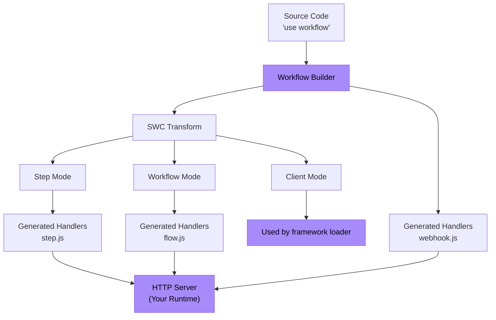

<Callout>
  **Pour les utilisateurs :** Si vous voulez simplement utiliser Workflow DevKit avec un framework existant, consultez plutôt le guide [Guide de démarrage](/docs/getting-started). Cette page s'adresse aux auteurs de framework qui souhaitent intégrer Workflow DevKit à leur framework ou runtime.
</Callout>

Ce guide vous explique comment construire une intégration de framework pour Workflow DevKit en utilisant Bun comme exemple concret. Les mêmes principes s'appliquent à n'importe quel runtime JavaScript (Node.js, Deno, Cloudflare Workers, etc.).

<Callout type="info">
  **Prérequis :** Avant de construire une intégration de framework, nous recommandons de lire [Comment fonctionnent les directives](/docs/how-it-works/code-transform) pour comprendre le système de transformation qui alimente Workflow DevKit.
</Callout>

## Ce que vous allez construire

Une intégration de framework comporte deux composantes principales :

1. **Temps de compilation** : Générer des fichiers gestionnaires de workflow (`flow.js`, `step.js`, `webhook.js`)
2. **Temps d'exécution** : Exposer ces gestionnaires comme points de terminaison HTTP dans votre serveur d'application



Les boîtes violettes représentent ce que vous implémentez — tout le reste est fourni par Workflow DevKit.

## Exemple : intégration Bun

Construisons une intégration complète pour Bun. Bun est particulier car il sert à la fois de runtime (nécessite des transformations de code) et de framework (fournit `Bun.serve()` pour le routage HTTP).

<Callout type="info">
  Un exemple fonctionnel peut être [trouvé ici](https://github.com/vercel/workflow-examples/tree/main/custom-adapter). Pour une référence prête pour la production, consultez l'[intégration Next.js](https://github.com/vercel/workflow/tree/main/packages/next).
</Callout>

### Étape 1 : Générer les fichiers de gestionnaires

Utilisez l'interface CLI `workflow` pour générer les bundles des gestionnaires. La CLI scanne votre répertoire `workflows/` et crée `flow.js`, `step.js` et `webhook.js`.

```json title="package.json"
{
  "scripts": {
    "dev": "bun x workflow build && PORT=3152 bun run server.ts"
  }
}
```

<Callout>
  **Pour les intégrations en production :** Au lieu d'utiliser la CLI, étendez directement la classe `BaseBuilder` dans votre plugin de framework. Cela vous donne le contrôle sur la surveillance des fichiers, les chemins de sortie personnalisés et les hooks spécifiques au framework. Voir le [plugin Next.js](https://github.com/vercel/workflow/tree/main/packages/next) pour un exemple.
</Callout>

**Ce qui est généré :**

- `/.well-known/workflow/v1/flow.js` - Gère l'exécution des workflows (transformation en mode workflow)
- `/.well-known/workflow/v1/step.js` - Gère l'exécution des steps (transformation en mode step)
- `/.well-known/workflow/v1/webhook.js` - Gère la livraison des webhooks

Chaque fichier exporte une fonction `POST` qui accepte des objets `Request` conformes aux standards Web.

### Étape 2 : Ajouter la transformation en mode client (optionnel)

Le mode client transforme votre code applicatif pour offrir une meilleure expérience développeur (DX). Ajoutez un plugin Bun pour appliquer cette transformation à l'exécution :

```typescript title="workflow-plugin.ts" lineNumbers
import { plugin } from "bun";
import { transform } from "@swc/core";

plugin({
  name: "workflow-transform",
  setup(build) {
    build.onLoad({ filter: /\.(ts|tsx|js|jsx)$/ }, async (args) => {
      const source = await Bun.file(args.path).text();

      // Optimization: Skip files that do not have any directives
      if (!source.match(/(use step|use workflow)/)) {
        return { contents: source };
      }

      const result = await transform(source, {
        filename: args.path,
        jsc: {
          experimental: {
            plugins: [
              [require.resolve("@workflow/swc-plugin"), { mode: "client" }], // [!code highlight]
            ],
          },
        },
      });

      return { contents: result.code, loader: "ts" };
    });
  },
});
```

Activez le plugin dans `bunfig.toml` :

```toml title="bunfig.toml"
preload = ["./workflow-plugin.ts"]
```

**Ce que cela fait :**

- Attache des IDs de workflow aux fonctions pour les utiliser avec `start()`
- Fournit une sécurité de type TypeScript
- Évite l'exécution directe accidentelle des workflows

**Pourquoi optionnel ?** Sans le mode client, vous pouvez toujours utiliser les workflows en construisant manuellement des IDs ou en vous référant au manifeste de build.

### Étape 3 : Exposer des points de terminaison HTTP

Branchez les gestionnaires générés aux points de terminaison HTTP en utilisant `Bun.serve()` :

```typescript title="server.ts" lineNumbers
import flow from "./.well-known/workflow/v1/flow.js";
import step from "./.well-known/workflow/v1/step.js";
import * as webhook from "./.well-known/workflow/v1/webhook.js";

import { start } from "workflow/api";
import { handleUserSignup } from "./workflows/user-signup.js";

const server = Bun.serve({
  port: process.env.PORT,
  routes: {
    "/.well-known/workflow/v1/flow": {
      POST: (req) => flow.POST(req),
    },
    "/.well-known/workflow/v1/step": {
      POST: (req) => step.POST(req),
    },
    // webhook exports handlers for GET, POST, DELETE, etc.
    "/.well-known/workflow/v1/webhook/:token": webhook,

    // Example: Start a workflow
    "/": {
      GET: async (req) => {
        const email = `test-${crypto.randomUUID()}@test.com`;
        const run = await start(handleUserSignup, [email]);
        return Response.json({
          message: "User signup workflow started",
          runId: run.runId,
        });
      },
    },
  },
});

console.log(`Server listening on http://localhost:${server.port}`);
```

**C'est tout !** Votre intégration Bun est complète.

## Comprendre les points de terminaison

Votre intégration doit exposer trois points de terminaison HTTP. Les gestionnaires générés gèrent tous les détails du protocole — vous ne faites que router les requêtes.

### Point de terminaison Workflow

**Route :** `POST /.well-known/workflow/v1/flow`

Exécute la logique d'orchestration des workflows. La fonction de workflow est « rendue » plusieurs fois pendant l'exécution — à chaque progression jusqu'à la prochaine étape.

**Appelé lorsque :**

- Démarrage d'un nouveau workflow
- Reprise après l'achèvement d'un step
- Reprise après le déclenchement d'un webhook ou d'un hook
- Récupération après des erreurs

### Point de terminaison Step

**Route :** `POST /.well-known/workflow/v1/step`

Exécute des opérations atomiques individuelles au sein des workflows. Chaque step s'exécute exactement une fois par exécution (sauf en cas de réessai dû à une erreur). Les steps ont un accès complet au runtime (APIs Node.js, système de fichiers, bases de données, etc.).

### Point de terminaison Webhook

**Route :** `POST /.well-known/workflow/v1/webhook/:token`

Transmet les données de webhook aux workflows en cours via [`createWebhook()`](/docs/api-reference/workflow/create-webhook). Le paramètre `:token` identifie quelle exécution de workflow doit recevoir les données.

<Callout type="info">
  La structure du fichier webhook varie selon le framework. Next.js génère `webhook/[token]/route.js` pour tirer parti du routage dynamique de l'App Router, tandis que d'autres frameworks génèrent un seul gestionnaire `webhook.js`.
</Callout>

## S'adapter à d'autres frameworks

L'exemple Bun démontre le modèle de base. Pour l'adapter à votre framework :

### Temps de build

**Option 1 : Utiliser la CLI** (le plus simple)

```bash
workflow build
```

Cela analysera par défaut le répertoire top-level `./workflows` pour les fichiers de workflow, et produira les fichiers bundlés directement dans votre répertoire de travail.

**Option 2 : Étendre `BaseBuilder`** (recommandé)

```typescript lineNumbers
import { BaseBuilder } from "@workflow/cli/dist/lib/builders/base-builder";

class MyFrameworkBuilder extends BaseBuilder {
  constructor(options) {
    super({
      dirs: ["workflows"],
      workingDir: options.rootDir,
      watch: options.dev,
    });
  }

  override async build(): Promise<void> {
    const inputFiles = await this.getInputFiles();

    await this.createWorkflowsBundle({
      outfile: "/path/to/.well-known/workflow/v1/flow.js",
      format: "esm",
      inputFiles,
    });

    await this.createStepsBundle({
      outfile: "/path/to/.well-known/workflow/v1/step.js",
      format: "esm",
      inputFiles,
    });

    await this.createWebhookBundle({
      outfile: "/path/to/.well-known/workflow/v1/webhook.js",
    });
  }
}
```

Si votre framework prend en charge des routes de serveur virtuel et la surveillance en mode dev, assurez-vous de vous adapter en conséquence. Veuillez ouvrir une PR sur Workflow DevKit si la classe base builder manque de fonctionnalités nécessaires.

Accrochez-vous au processus de build de votre framework :

```typescript title="pseudocode.ts" lineNumbers
framework.hooks.hook("build:before", async () => {
  await new MyFrameworkBuilder(framework).build();
});
```

### Runtime (mode client)

Ajoutez un loader/plugin pour votre bundler :

**Rollup/Vite :**

```typescript lineNumbers
export function workflowPlugin() {
  return {
    name: "workflow-client-transform",
    async transform(code, id) {
      if (!code.match(/(use step|use workflow)/)) return null;

      const result = await transform(code, {
        filename: id,
        jsc: {
          experimental: {
            plugins: [[require.resolve("@workflow/swc-plugin"), { mode: "client" }]], // [!code highlight]
          },
        },
      });

      return { code: result.code, map: result.map };
    },
  };
}
```

**Webpack :**

```javascript lineNumbers
module.exports = {
  module: {
    rules: [
      {
        test: /\.(ts|tsx|js|jsx)$/,
        use: "workflow-client-loader", // Similar implementation
      },
    ],
  },
};
```

### Serveur HTTP

Routez les trois points de terminaison vers les gestionnaires générés. L'implémentation exacte dépend de l'API de routage de votre framework.

Dans l'exemple Bun ci-dessus, nous avons laissé le routage à l'utilisateur. Essentiellement, l'utilisateur doit servir des routes comme ceci :

```typescript title="server.ts" lineNumbers
import flow from "./.well-known/workflow/v1/flow.js";
import step from "./.well-known/workflow/v1/step.js";
import * as webhook from "./.well-known/workflow/v1/webhook.js";

// Expose the 3 generated routes
const server = Bun.serve({
  routes: {
    "/.well-known/workflow/v1/flow": {
      POST: (req) => flow.POST(req),
    },
    "/.well-known/workflow/v1/step": {
      POST: (req) => step.POST(req),
    },
    // webhook exports handlers for GET, POST, DELETE, etc.
    "/.well-known/workflow/v1/webhook/:token": webhook,
  },
});
```

Les intégrations de framework destinées à la production devraient gérer ce routage dans le plugin au lieu de le laisser à l'utilisateur, et cela dépend de l'implémentation propre à chaque framework. Consultez le code source de Workflow DevKit pour des exemples d'implémentations de framework prêtes pour la production. À l'avenir, Workflow DevKit émettra davantage de routes sous l'espace de noms `.well-known/workflow`.

## Sécurité

**Comment ces points de terminaison HTTP sont-ils sécurisés ?**

La sécurité est gérée par l'**abstraction world** que vous utilisez :

**Vercel (`@workflow/world-vercel`) :**

- Vercel Queue prendra en charge l'invocation privée, rendant les routes inaccessibles depuis l'internet public
- Les handlers reçoivent uniquement un ID de message qui doit être récupéré depuis le backend de Vercel
- Impossible de créer des payloads personnalisés sans des identifiants de message valides émis par la queue

**Implémentations personnalisées :**

- Implémentez l'authentification via le middleware du framework
- Utilisez des clés API, la validation JWT ou d'autres schémas d'authentification
- Sécurité au niveau réseau (VPC, réseaux privés, règles de pare-feu)
- Limitation de débit et validation des requêtes

En savoir plus sur les [abstractions 'world'](/docs/deploying/world).

## Tester votre intégration

### 1. Tester la sortie du build

Créez un workflow de test :

```typescript title="workflows/test.ts" lineNumbers
import { sleep, createWebhook } from "workflow";

export async function handleUserSignup(email: string) {
  "use workflow";

  const user = await createUser(email);
  await sendWelcomeEmail(user);

  await sleep("5s");

  const webhook = createWebhook();
  await sendOnboardingEmail(user, webhook.url);

  await webhook;
  console.log("Webhook Resolved");

  return { userId: user.id, status: "onboarded" };
}

async function createUser(email: string) {
  "use step";

  console.log(`Creating a new user with email: ${email}`);

  return { id: crypto.randomUUID(), email };
}

async function sendWelcomeEmail(user: { id: string; email: string }) {
  "use step";

  console.log(`Sending welcome email to user: ${user.id}`);
}

async function sendOnboardingEmail(user: { id: string; email: string }, callback: string) {
  "use step";

  console.log(`Sending onboarding email to user: ${user.id}`);

  console.log(`Click this link to resolve the webhook: ${callback}`);
}

```

Exécutez votre build et vérifiez :

- `.well-known/workflow/v1/flow.js` existe
- `.well-known/workflow/v1/step.js` existe
- `.well-known/workflow/v1/webhook.js` existe

### 2. Tester les points de terminaison HTTP

Démarrez votre serveur et vérifiez que les routes répondent :

```bash
curl -X POST http://localhost:3000/.well-known/workflow/v1/flow
curl -X POST http://localhost:3000/.well-known/workflow/v1/step
curl -X POST http://localhost:3000/.well-known/workflow/v1/webhook/test
```

(Devrait répondre mais ne pas déclencher de code significatif sans authentification/exécution de workflow appropriée)

### 3. Exécuter un workflow de bout en bout

```typescript
import { start } from "workflow/api";
import { handleUserSignup } from "./workflows/test";

const run = await start(handleUserSignup, ["test@example.com"]);
console.log("Workflow started:", run.runId);
```