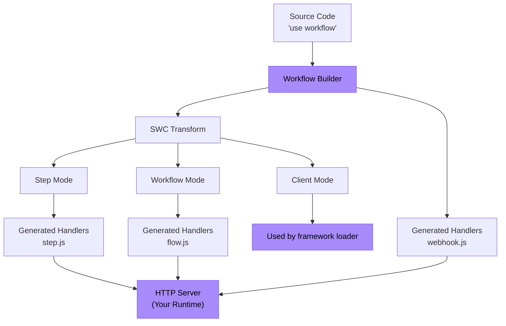

<Callout>
  **Untuk pengguna:** Jika Anda hanya ingin menggunakan Workflow DevKit dengan kerangka kerja yang ada, lihat panduan [Memulai](/docs/getting-started) sebagai gantinya. Halaman ini ditujukan untuk penulis kerangka kerja yang ingin mengintegrasikan Workflow DevKit dengan kerangka kerja atau runtime mereka.
</Callout>

Panduan ini memandu Anda melalui pembuatan integrasi kerangka kerja untuk Workflow DevKit menggunakan Bun sebagai contoh konkret. Prinsip yang sama berlaku untuk runtime JavaScript apa pun (Node.js, Deno, Cloudflare Workers, dll.).

<Callout type="info">
  **Prasyarat:** Sebelum membangun integrasi kerangka kerja, kami menyarankan membaca [Bagaimana Direktif Bekerja](/docs/how-it-works/code-transform) untuk memahami sistem transformasi yang menggerakkan Workflow DevKit.
</Callout>

## Apa yang Akan Anda Bangun

Integrasi kerangka kerja memiliki dua komponen utama:

1. **Waktu build**: Menghasilkan berkas handler workflow (`flow.js`, `step.js`, `webhook.js`)
2. **Runtime**: Mengekspos handler ini sebagai endpoint HTTP di server aplikasi Anda



Kotak ungu adalah yang Anda implementasikan—semua lainnya disediakan oleh Workflow DevKit.

## Contoh: Integrasi Bun

Mari bangun integrasi lengkap untuk Bun. Bun unik karena berfungsi sebagai runtime (membutuhkan transformasi kode) sekaligus sebagai kerangka kerja (menyediakan `Bun.serve()` untuk routing HTTP).

<Callout type="info">
  Contoh yang berfungsi dapat [ditemukan di sini](https://github.com/vercel/workflow-examples/tree/main/custom-adapter). Untuk referensi siap-produksi, lihat [integrasi Next.js](https://github.com/vercel/workflow/tree/main/packages/next).
</Callout>

### Langkah 1: Menghasilkan Berkas Handler

Gunakan CLI `workflow` untuk menghasilkan bundel handler. CLI memindai direktori `workflows/` Anda dan membuat `flow.js`, `step.js`, dan `webhook.js`.

```json title="package.json"
{
  "scripts": {
    "dev": "bun x workflow build && PORT=3152 bun run server.ts"
  }
}
```

<Callout>
  **Untuk integrasi produksi:** Alih-alih menggunakan CLI, perluas kelas `BaseBuilder` secara langsung di plugin kerangka kerja Anda. Ini memberi Anda kontrol atas pemantauan berkas, jalur keluaran kustom, dan hook khusus kerangka kerja. Lihat [plugin Next.js](https://github.com/vercel/workflow/tree/main/packages/next) untuk contoh.
</Callout>

**Apa yang dihasilkan:**

- `/.well-known/workflow/v1/flow.js` - Menangani eksekusi workflow (transformasi mode workflow)
- `/.well-known/workflow/v1/step.js` - Menangani eksekusi langkah (transformasi mode step)
- `/.well-known/workflow/v1/webhook.js` - Menangani pengiriman webhook

Setiap berkas mengekspor fungsi `POST` yang menerima objek `Request` standar Web.

### Langkah 2: Tambahkan Transformasi Mode Klien (Opsional)

Mode klien mentransformasi kode aplikasi Anda untuk memberikan pengalaman pengembang (DX) yang lebih baik. Tambahkan plugin Bun untuk menerapkan transformasi ini saat runtime:

```typescript title="workflow-plugin.ts" lineNumbers
import { plugin } from "bun";
import { transform } from "@swc/core";

plugin({
  name: "workflow-transform",
  setup(build) {
    build.onLoad({ filter: /\.(ts|tsx|js|jsx)$/ }, async (args) => {
      const source = await Bun.file(args.path).text();

      // Optimization: Skip files that do not have any directives
      if (!source.match(/(use step|use workflow)/)) {
        return { contents: source };
      }

      const result = await transform(source, {
        filename: args.path,
        jsc: {
          experimental: {
            plugins: [
              [require.resolve("@workflow/swc-plugin"), { mode: "client" }], // [!code highlight]
            ],
          },
        },
      });

      return { contents: result.code, loader: "ts" };
    });
  },
});
```

Aktifkan plugin di `bunfig.toml`:

```toml title="bunfig.toml"
preload = ["./workflow-plugin.ts"]
```

**Apa yang dilakukan ini:**

- Menempelkan ID workflow ke fungsi untuk digunakan dengan `start()`
- Menyediakan keamanan tipe TypeScript
- Mencegah eksekusi langsung workflow secara tidak sengaja

**Mengapa opsional?** Tanpa mode klien, Anda masih bisa menggunakan workflow dengan membangun ID secara manual atau merujuk ke manifest build.

### Langkah 3: Mengekspos Endpoint HTTP

Hubungkan handler yang dihasilkan ke endpoint HTTP menggunakan `Bun.serve()`:

```typescript title="server.ts" lineNumbers
import flow from "./.well-known/workflow/v1/flow.js";
import step from "./.well-known/workflow/v1/step.js";
import * as webhook from "./.well-known/workflow/v1/webhook.js";

import { start } from "workflow/api";
import { handleUserSignup } from "./workflows/user-signup.js";

const server = Bun.serve({
  port: process.env.PORT,
  routes: {
    "/.well-known/workflow/v1/flow": {
      POST: (req) => flow.POST(req),
    },
    "/.well-known/workflow/v1/step": {
      POST: (req) => step.POST(req),
    },
    // webhook exports handlers for GET, POST, DELETE, etc.
    "/.well-known/workflow/v1/webhook/:token": webhook,

    // Example: Start a workflow
    "/": {
      GET: async (req) => {
        const email = `test-${crypto.randomUUID()}@test.com`;
        const run = await start(handleUserSignup, [email]);
        return Response.json({
          message: "User signup workflow started",
          runId: run.runId,
        });
      },
    },
  },
});

console.log(`Server listening on http://localhost:${server.port}`);
```

**Selesai!** Integrasi Bun Anda selesai.

## Memahami Endpoint

Integrasi Anda harus mengekspos tiga endpoint HTTP. Handler yang dihasilkan mengelola semua detail protokol—Anda hanya perlu merutekan permintaan.

### Endpoint Workflow

**Rute:** `POST /.well-known/workflow/v1/flow`

Menjalankan logika orkestrasi workflow. Fungsi workflow "dirender" beberapa kali selama eksekusi—setiap kali berlanjut hingga menemukan langkah berikutnya.

**Dipanggil ketika:**

- Memulai workflow baru
- Melanjutkan setelah sebuah langkah selesai
- Melanjutkan setelah webhook atau hook memicu
- Memulihkan dari kegagalan

### Endpoint Langkah

**Rute:** `POST /.well-known/workflow/v1/step`

Menjalankan operasi atomik individual dalam workflow. Setiap langkah dijalankan tepat satu kali per eksekusi (kecuali dicoba ulang karena kegagalan). Langkah memiliki akses runtime penuh (API Node.js, sistem berkas, basis data, dll.).

### Endpoint Webhook

**Rute:** `POST /.well-known/workflow/v1/webhook/:token`

Menyampaikan data webhook ke workflow yang sedang berjalan melalui [`createWebhook()`](/docs/api-reference/workflow/create-webhook). Parameter `:token` mengidentifikasi run workflow mana yang harus menerima data.

<Callout type="info">
  Struktur berkas webhook bervariasi menurut kerangka kerja. Next.js menghasilkan `webhook/[token]/route.js` untuk memanfaatkan routing dinamis App Router, sementara kerangka kerja lain menghasilkan satu handler `webhook.js`.
</Callout>

## Mengadaptasi ke Kerangka Kerja Lain

Contoh Bun menunjukkan pola inti. Untuk mengadaptasi ke kerangka kerja Anda:

### Saat Build

**Opsi 1: Gunakan CLI** (paling sederhana)

```bash
workflow build
```

Ini akan secara default memindai direktori top-level `./workflows` untuk berkas workflow, dan akan mengeluarkan berkas bundel langsung ke direktori kerja Anda.

**Opsi 2: Perluas `BaseBuilder`** (disarankan)

```typescript lineNumbers
import { BaseBuilder } from "@workflow/cli/dist/lib/builders/base-builder";

class MyFrameworkBuilder extends BaseBuilder {
  constructor(options) {
    super({
      dirs: ["workflows"],
      workingDir: options.rootDir,
      watch: options.dev,
    });
  }

  override async build(): Promise<void> {
    const inputFiles = await this.getInputFiles();

    await this.createWorkflowsBundle({
      outfile: "/path/to/.well-known/workflow/v1/flow.js",
      format: "esm",
      inputFiles,
    });

    await this.createStepsBundle({
      outfile: "/path/to/.well-known/workflow/v1/step.js",
      format: "esm",
      inputFiles,
    });

    await this.createWebhookBundle({
      outfile: "/path/to/.well-known/workflow/v1/webhook.js",
    });
  }
}
```

Jika kerangka kerja Anda mendukung rute server virtual dan pemantauan mode dev, pastikan untuk menyesuaikannya. Mohon buka PR ke Workflow DevKit jika kelas base builder kekurangan fungsionalitas yang diperlukan.

Hubungkan ke proses build kerangka kerja Anda:

```typescript title="pseudocode.ts" lineNumbers
framework.hooks.hook("build:before", async () => {
  await new MyFrameworkBuilder(framework).build();
});
```

### Runtime (Mode Klien)

Tambahkan loader/plugin untuk bundler Anda:

**Rollup/Vite:**

```typescript lineNumbers
export function workflowPlugin() {
  return {
    name: "workflow-client-transform",
    async transform(code, id) {
      if (!code.match(/(use step|use workflow)/)) return null;

      const result = await transform(code, {
        filename: id,
        jsc: {
          experimental: {
            plugins: [[require.resolve("@workflow/swc-plugin"), { mode: "client" }]], // [!code highlight]
          },
        },
      });

      return { code: result.code, map: result.map };
    },
  };
}
```

**Webpack:**

```javascript lineNumbers
module.exports = {
  module: {
    rules: [
      {
        test: /\.(ts|tsx|js|jsx)$/,
        use: "workflow-client-loader", // Similar implementation
      },
    ],
  },
};
```

### Server HTTP

Rutekan ketiga endpoint ke handler yang dihasilkan. Implementasi tepat bergantung pada API routing kerangka kerja Anda.

Dalam contoh Bun di atas, kami menyerahkan routing ke pengguna. Pada dasarnya, pengguna harus menyajikan rute seperti ini:

```typescript title="server.ts" lineNumbers
import flow from "./.well-known/workflow/v1/flow.js";
import step from "./.well-known/workflow/v1/step.js";
import * as webhook from "./.well-known/workflow/v1/webhook.js";

// Expose the 3 generated routes
const server = Bun.serve({
  routes: {
    "/.well-known/workflow/v1/flow": {
      POST: (req) => flow.POST(req),
    },
    "/.well-known/workflow/v1/step": {
      POST: (req) => step.POST(req),
    },
    // webhook exports handlers for GET, POST, DELETE, etc.
    "/.well-known/workflow/v1/webhook/:token": webhook,
  },
});
```

Integrasi kerangka kerja produksi sebaiknya menangani routing ini di plugin, bukan menyerahkannya kepada pengguna, dan ini bergantung pada implementasi unik setiap kerangka kerja. Periksa kode sumber Workflow DevKit untuk contoh implementasi kerangka kerja produksi. Di masa depan, Workflow DevKit akan menerbitkan lebih banyak rute di bawah namespace `.well-known/workflow`.

## Keamanan

**Bagaimana endpoint HTTP ini diamankan?**

Keamanan ditangani oleh **abstraksi world** yang Anda gunakan:

**Vercel (`@workflow/world-vercel`):**

- Vercel Queue akan mendukung pemanggilan privat, sehingga rute tidak dapat diakses dari internet publik
- Handler hanya menerima ID pesan yang harus diambil dari backend Vercel
- Tidak mungkin membuat payload kustom tanpa ID pesan yang dikeluarkan oleh queue yang valid

**Implementasi kustom:**

- Terapkan autentikasi lewat middleware kerangka kerja
- Gunakan API key, validasi JWT, atau skema otentikasi lainnya
- Keamanan tingkat jaringan (VPC, jaringan privat, aturan firewall)
- Pembatasan laju dan validasi permintaan

Pelajari lebih lanjut tentang [abstraksi world](/docs/deploying/world).

## Menguji Integrasi Anda

### 1. Uji Hasil Build

Buat workflow pengujian:

```typescript title="workflows/test.ts" lineNumbers
import { sleep, createWebhook } from "workflow";

export async function handleUserSignup(email: string) {
  "use workflow";

  const user = await createUser(email);
  await sendWelcomeEmail(user);

  await sleep("5s");

  const webhook = createWebhook();
  await sendOnboardingEmail(user, webhook.url);

  await webhook;
  console.log("Webhook Resolved");

  return { userId: user.id, status: "onboarded" };
}

async function createUser(email: string) {
  "use step";

  console.log(`Creating a new user with email: ${email}`);

  return { id: crypto.randomUUID(), email };
}

async function sendWelcomeEmail(user: { id: string; email: string }) {
  "use step";

  console.log(`Sending welcome email to user: ${user.id}`);
}

async function sendOnboardingEmail(user: { id: string; email: string }, callback: string) {
  "use step";

  console.log(`Sending onboarding email to user: ${user.id}`);

  console.log(`Click this link to resolve the webhook: ${callback}`);
}

```

Jalankan build Anda dan verifikasi:

- `.well-known/workflow/v1/flow.js` terdapat
- `.well-known/workflow/v1/step.js` terdapat
- `.well-known/workflow/v1/webhook.js` terdapat

### 2. Uji Endpoint HTTP

Mulai server Anda dan verifikasi rute merespons:

```bash
curl -X POST http://localhost:3000/.well-known/workflow/v1/flow
curl -X POST http://localhost:3000/.well-known/workflow/v1/step
curl -X POST http://localhost:3000/.well-known/workflow/v1/webhook/test
```

(Harap merespons tetapi tidak memicu kode yang berarti tanpa autentikasi atau run workflow yang tepat)

### 3. Jalankan Workflow Secara End-to-End

```typescript
import { start } from "workflow/api";
import { handleUserSignup } from "./workflows/test";

const run = await start(handleUserSignup, ["test@example.com"]);
console.log("Workflow started:", run.runId);
```