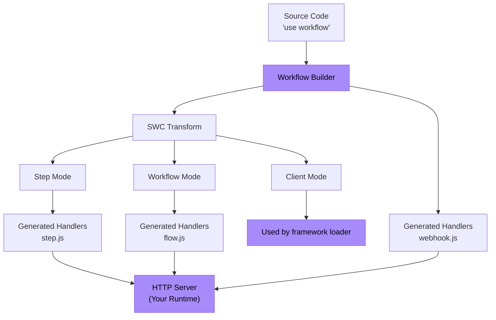

<Callout>
  **ユーザー向け:** 既存のフレームワークで単に Workflow DevKit を使いたい場合は、代わりに[はじめに](/docs/getting-started)ガイドを参照してください。このページは、Workflow DevKit を自分のフレームワークやランタイムに統合したい**フレームワーク作成者向け**です。
</Callout>

このガイドでは、具体例として Bun を用いて Workflow DevKit のフレームワーク統合を構築する手順を説明します。同じ原則は任意の JavaScript ランタイム（Node.js、Deno、Cloudflare Workers など）にも適用されます。

<Callout type="info">
  **前提条件:** フレームワーク統合を構築する前に、Workflow DevKit を動かす変換システムを理解するために[ディレクティブの仕組み](/docs/how-it-works/code-transform)を読むことを推奨します。
</Callout>

## 何を構築するか

フレームワーク統合には主に二つのコンポーネントがあります:

1. **ビルド時**: ワークフローハンドラファイル（`flow.js`, `step.js`, `webhook.js`）を生成する
2. **ランタイム**: これらのハンドラをアプリケーションサーバー上の HTTP エンドポイントとして公開する



紫色のボックスがあなたが実装する部分で、それ以外は Workflow DevKit が提供します。

## 例: Bun 統合

Bun の完全な統合を構築してみましょう。Bun はランタイム（コード変換が必要）であると同時にフレームワーク（HTTP ルーティングのために `Bun.serve()` を提供）としての性質を持つ点でユニークです。

<Callout type="info">
  動作する例は[こちら](https://github.com/vercel/workflow-examples/tree/main/custom-adapter)で確認できます。実運用向けのリファレンスは[Next.js 統合](https://github.com/vercel/workflow/tree/main/packages/next)を参照してください。
</Callout>

### ステップ 1: ハンドラファイルを生成する

`workflow` CLI を使ってハンドラバンドルを生成します。CLI は `workflows/` ディレクトリをスキャンして `flow.js`, `step.js`, および `webhook.js` を作成します。

```json title="package.json"
{
  "scripts": {
    "dev": "bun x workflow build && PORT=3152 bun run server.ts"
  }
}
```

<Callout>
  **本番向け統合の場合:** CLI を使う代わりに、フレームワークプラグイン内で直接 `BaseBuilder` クラスを拡張することを検討してください。これによりファイル監視、カスタム出力パス、フレームワーク固有のフックなどを制御できます。例は [Next.js プラグイン](https://github.com/vercel/workflow/tree/main/packages/next) を参照してください。
</Callout>

**生成されるもの:**

- `/.well-known/workflow/v1/flow.js` - ワークフロー実行を処理（workflow mode transform）
- `/.well-known/workflow/v1/step.js` - ステップ実行を処理（step mode transform）
- `/.well-known/workflow/v1/webhook.js` - Webhook 配信を処理

各ファイルは Web 標準の `Request` オブジェクトを受け取る `POST` 関数をエクスポートします。

### ステップ 2: クライアントモード変換を追加（オプション）

クライアントモードはアプリケーションコードを変換してより良い開発者体験（DX）を提供します。ランタイムでこの変換を適用するために Bun プラグインを追加します:

```typescript title="workflow-plugin.ts" lineNumbers
import { plugin } from "bun";
import { transform } from "@swc/core";

plugin({
  name: "workflow-transform",
  setup(build) {
    build.onLoad({ filter: /\.(ts|tsx|js|jsx)$/ }, async (args) => {
      const source = await Bun.file(args.path).text();

      // Optimization: Skip files that do not have any directives
      if (!source.match(/(use step|use workflow)/)) {
        return { contents: source };
      }

      const result = await transform(source, {
        filename: args.path,
        jsc: {
          experimental: {
            plugins: [
              [require.resolve("@workflow/swc-plugin"), { mode: "client" }], // [!code highlight]
            ],
          },
        },
      });

      return { contents: result.code, loader: "ts" };
    });
  },
});
```

`bunfig.toml` でプラグインを有効化します:

```toml title="bunfig.toml"
preload = ["./workflow-plugin.ts"]
```

**これが行うこと:**

- `start()` で使用するために関数にワークフロー ID を付与する
- TypeScript の型安全性を提供する
- ワークフローの誤った直接実行を防ぐ

**なぜオプションなのか？** クライアントモードがなくても、ID を手動で構築したりビルドマニフェストを参照することでワークフローを使用できます。

### ステップ 3: HTTP エンドポイントを公開する

生成されたハンドラを `Bun.serve()` を使って HTTP エンドポイントに接続します:

```typescript title="server.ts" lineNumbers
import flow from "./.well-known/workflow/v1/flow.js";
import step from "./.well-known/workflow/v1/step.js";
import * as webhook from "./.well-known/workflow/v1/webhook.js";

import { start } from "workflow/api";
import { handleUserSignup } from "./workflows/user-signup.js";

const server = Bun.serve({
  port: process.env.PORT,
  routes: {
    "/.well-known/workflow/v1/flow": {
      POST: (req) => flow.POST(req),
    },
    "/.well-known/workflow/v1/step": {
      POST: (req) => step.POST(req),
    },
    // webhook exports handlers for GET, POST, DELETE, etc.
    "/.well-known/workflow/v1/webhook/:token": webhook,

    // Example: Start a workflow
    "/": {
      GET: async (req) => {
        const email = `test-${crypto.randomUUID()}@test.com`;
        const run = await start(handleUserSignup, [email]);
        return Response.json({
          message: "User signup workflow started",
          runId: run.runId,
        });
      },
    },
  },
});

console.log(`Server listening on http://localhost:${server.port}`);
```

**これで完了です！** あなたの Bun 統合は完成です。

## エンドポイントの理解

統合は 3 つの HTTP エンドポイントを公開する必要があります。生成されたハンドラがプロトコルの詳細をすべて管理するので、あなたはリクエストをルーティングするだけです。

### ワークフローエンドポイント

**ルート:** `POST /.well-known/workflow/v1/flow`

ワークフローのオーケストレーションロジックを実行します。ワークフロー関数は実行中に何度も「レンダリング」され、各進行で次のステップに遭遇するまで続きます。

**呼び出されるタイミング:**

- 新しいワークフローを開始するとき
- ステップ完了後に再開するとき
- Webhook やフックがトリガーされた後に再開するとき
- 障害からの復旧時

### ステップエンドポイント

**ルート:** `POST /.well-known/workflow/v1/step`

ワークフロー内の個々の原子操作を実行します。各ステップは実行ごとにちょうど一度実行されます（障害によりリトライされない限り）。ステップはランタイムの完全なアクセス権を持ちます（Node.js API、ファイルシステム、データベースなど）。

### Webhook エンドポイント

**ルート:** `POST /.well-known/workflow/v1/webhook/:token`

[`createWebhook()`](/docs/api-reference/workflow/create-webhook) を介して実行中のワークフローに webhook データを配送します。`:token` パラメータはどのワークフロー実行がデータを受け取るかを識別します。

<Callout type="info">
  webhook ファイル構造はフレームワークによって異なります。Next.js は App Router の動的ルーティングを活用するために `webhook/[token]/route.js` を生成しますが、他のフレームワークは単一の `webhook.js` ハンドラを生成します。
</Callout>

## 他のフレームワークへの適応

Bun の例はコアパターンを示しています。あなたのフレームワーク向けに適応するには次を参照してください:

### ビルド時

**オプション 1: CLI を使う**（最も簡単）

```bash
workflow build
```

これはデフォルトでワークフローファイルをトップレベルの `./workflows` ディレクトリからスキャンし、バンドルされたファイルを作業ディレクトリに直接出力します。

**オプション 2: `BaseBuilder` を拡張する**（推奨）

```typescript lineNumbers
import { BaseBuilder } from "@workflow/cli/dist/lib/builders/base-builder";

class MyFrameworkBuilder extends BaseBuilder {
  constructor(options) {
    super({
      dirs: ["workflows"],
      workingDir: options.rootDir,
      watch: options.dev,
    });
  }

  override async build(): Promise<void> {
    const inputFiles = await this.getInputFiles();

    await this.createWorkflowsBundle({
      outfile: "/path/to/.well-known/workflow/v1/flow.js",
      format: "esm",
      inputFiles,
    });

    await this.createStepsBundle({
      outfile: "/path/to/.well-known/workflow/v1/step.js",
      format: "esm",
      inputFiles,
    });

    await this.createWebhookBundle({
      outfile: "/path/to/.well-known/workflow/v1/webhook.js",
    });
  }
}
```

フレームワークが仮想サーバールートや開発モードの監視をサポートしている場合は、それに合わせて適応してください。もしベースビルダークラスに必要な機能が欠けている場合は、Workflow DevKit に PR を送ってください。

フレームワークのビルドフックに接続します:

```typescript title="pseudocode.ts" lineNumbers
framework.hooks.hook("build:before", async () => {
  await new MyFrameworkBuilder(framework).build();
});
```

### ランタイム（クライアントモード）

バンドラ用のローダ／プラグインを追加します:

**Rollup/Vite:**

```typescript lineNumbers
export function workflowPlugin() {
  return {
    name: "workflow-client-transform",
    async transform(code, id) {
      if (!code.match(/(use step|use workflow)/)) return null;

      const result = await transform(code, {
        filename: id,
        jsc: {
          experimental: {
            plugins: [[require.resolve("@workflow/swc-plugin"), { mode: "client" }]], // [!code highlight]
          },
        },
      });

      return { code: result.code, map: result.map };
    },
  };
}
```

**Webpack:**

```javascript lineNumbers
module.exports = {
  module: {
    rules: [
      {
        test: /\.(ts|tsx|js|jsx)$/,
        use: "workflow-client-loader", // Similar implementation
      },
    ],
  },
};
```

### HTTP サーバー

生成されたハンドラに 3 つのエンドポイントをルーティングします。具体的な実装はフレームワークのルーティング API に依存します。

上の bun の例ではルーティングをユーザー任せにしました。基本的には、ユーザーが次のようなルートを提供する必要があります:

```typescript title="server.ts" lineNumbers
import flow from "./.well-known/workflow/v1/flow.js";
import step from "./.well-known/workflow/v1/step.js";
import * as webhook from "./.well-known/workflow/v1/webhook.js";

// Expose the 3 generated routes
const server = Bun.serve({
  routes: {
    "/.well-known/workflow/v1/flow": {
      POST: (req) => flow.POST(req),
    },
    "/.well-known/workflow/v1/step": {
      POST: (req) => step.POST(req),
    },
    // webhook exports handlers for GET, POST, DELETE, etc.
    "/.well-known/workflow/v1/webhook/:token": webhook,
  },
});
```

本番向けのフレームワーク統合は、このルーティングをユーザー任せにするのではなくプラグイン側で処理するべきであり、これは各フレームワーク固有の実装に依存します。実装例については Workflow DevKit のソースコードを確認してください。
将来的には Workflow DevKit は `.well-known/workflow` ネームスペース下でさらに多くのルートを出力する予定です。

## セキュリティ

**これらの HTTP エンドポイントはどのように保護されるのか？**

セキュリティは、使用している **world 抽象化** によって扱われます:

**Vercel (`@workflow/world-vercel`):**

- Vercel Queue はプライベートインボークをサポートし、ルートをパブリックインターネットからアクセスできなくします
- ハンドラは Vercel のバックエンドから取得されるメッセージ ID のみを受け取ります
- 有効なキュー発行のメッセージ ID なしにカスタムペイロードを作成することは不可能です

**カスタム実装:**

- フレームワークのミドルウェアを介して認証を実装する
- API キー、JWT 検証、その他の認証スキームを使用する
- ネットワークレベルのセキュリティ（VPC、プライベートネットワーク、ファイアウォールルール）
- レート制限とリクエスト検証

[world 抽象化](/docs/deploying/world) の詳細を参照してください。

## 統合のテスト

### 1. ビルド出力のテスト

テスト用のワークフローを作成します:

```typescript title="workflows/test.ts" lineNumbers
import { sleep, createWebhook } from "workflow";

export async function handleUserSignup(email: string) {
  "use workflow";

  const user = await createUser(email);
  await sendWelcomeEmail(user);

  await sleep("5s");

  const webhook = createWebhook();
  await sendOnboardingEmail(user, webhook.url);

  await webhook;
  console.log("Webhook Resolved");

  return { userId: user.id, status: "onboarded" };
}

async function createUser(email: string) {
  "use step";

  console.log(`Creating a new user with email: ${email}`);

  return { id: crypto.randomUUID(), email };
}

async function sendWelcomeEmail(user: { id: string; email: string }) {
  "use step";

  console.log(`Sending welcome email to user: ${user.id}`);
}

async function sendOnboardingEmail(user: { id: string; email: string }, callback: string) {
  "use step";

  console.log(`Sending onboarding email to user: ${user.id}`);

  console.log(`Click this link to resolve the webhook: ${callback}`);
}

```

ビルドを実行して次を確認してください:

- `.well-known/workflow/v1/flow.js` が存在する
- `.well-known/workflow/v1/step.js` が存在する
- `.well-known/workflow/v1/webhook.js` が存在する

### 2. HTTP エンドポイントのテスト

サーバーを起動してルートが応答することを確認します:

```bash
curl -X POST http://localhost:3000/.well-known/workflow/v1/flow
curl -X POST http://localhost:3000/.well-known/workflow/v1/step
curl -X POST http://localhost:3000/.well-known/workflow/v1/webhook/test
```

（認証や適切なワークフロー実行がない状態では応答はあるが有意なコードはトリガーされないはずです）

### 3. ワークフローをエンドツーエンドで実行する

```typescript
import { start } from "workflow/api";
import { handleUserSignup } from "./workflows/test";

const run = await start(handleUserSignup, ["test@example.com"]);
console.log("Workflow started:", run.runId);
```