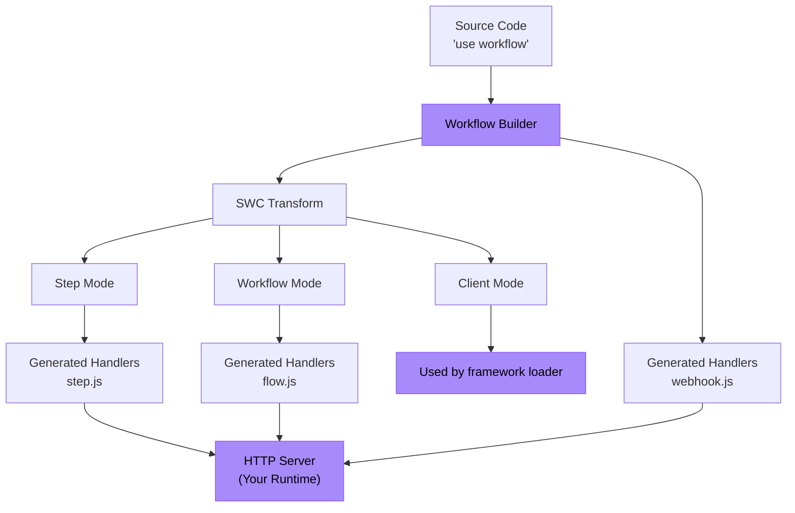

<Callout>
  **Para usuários:** Se você só quer usar o Workflow DevKit com um framework existente, confira o guia de [Primeiros passos](/docs/getting-started) em vez disso. Esta página é para autores de frameworks que desejam integrar o Workflow DevKit ao seu framework ou runtime.
</Callout>

Este guia orienta você na construção de uma integração de framework para o Workflow DevKit usando Bun como exemplo concreto. Os mesmos princípios se aplicam a qualquer runtime JavaScript (Node.js, Deno, Cloudflare Workers, etc.).

<Callout type="info">
  **Pré-requisitos:** Antes de construir uma integração de framework, recomendamos a leitura de [Como as Diretivas Funcionam](/docs/how-it-works/code-transform) para entender o sistema de transformação que alimenta o Workflow DevKit.
</Callout>

## O que você irá construir

Uma integração de framework tem dois componentes principais:

1. **Tempo de build**: Gerar arquivos de manipulador de workflow (`flow.js`, `step.js`, `webhook.js`)
2. **Tempo de execução**: Expor esses manipuladores como endpoints HTTP no servidor da sua aplicação



As caixas roxas são o que você implementa — todo o resto é fornecido pelo Workflow DevKit.

## Exemplo: Integração com Bun

Vamos construir uma integração completa para Bun. Bun é único porque serve tanto como runtime (precisa de transformações de código) quanto como framework (fornece `Bun.serve()` para roteamento HTTP).

<Callout type="info">
  Um exemplo funcional pode ser [encontrado aqui](https://github.com/vercel/workflow-examples/tree/main/custom-adapter). Para uma referência pronta para produção, veja a [integração do Next.js](https://github.com/vercel/workflow/tree/main/packages/next).
</Callout>

### Passo 1: Gerar arquivos de manipulador

Use o CLI `workflow` para gerar os bundles de manipuladores. O CLI escaneia seu diretório `workflows/` e cria `flow.js`, `step.js` e `webhook.js`.

```json title="package.json"
{
  "scripts": {
    "dev": "bun x workflow build && PORT=3152 bun run server.ts"
  }
}
```

<Callout>
  **Para integrações de produção:** Em vez de usar o CLI, estenda a classe `BaseBuilder` diretamente no plugin do seu framework. Isso lhe dá controle sobre observação de arquivos, caminhos de saída personalizados e hooks específicos do framework. Veja o [plugin do Next.js](https://github.com/vercel/workflow/tree/main/packages/next) como exemplo.
</Callout>

**O que é gerado:**

- `/.well-known/workflow/v1/flow.js` - Responsável pela execução de workflows (transformação em modo workflow)
- `/.well-known/workflow/v1/step.js` - Responsável pela execução de steps (transformação em modo step)
- `/.well-known/workflow/v1/webhook.js` - Responsável pela entrega de webhooks

Cada arquivo exporta uma função `POST` que aceita objetos `Request` padrão da Web.

### Passo 2: Adicionar Transformação em Modo Cliente (Opcional)

O modo cliente transforma o código da sua aplicação para proporcionar uma melhor experiência de desenvolvedor. Adicione um plugin Bun para aplicar essa transformação em tempo de execução:

```typescript title="workflow-plugin.ts" lineNumbers
import { plugin } from "bun";
import { transform } from "@swc/core";

plugin({
  name: "workflow-transform",
  setup(build) {
    build.onLoad({ filter: /\.(ts|tsx|js|jsx)$/ }, async (args) => {
      const source = await Bun.file(args.path).text();

      // Optimization: Skip files that do not have any directives
      if (!source.match(/(use step|use workflow)/)) {
        return { contents: source };
      }

      const result = await transform(source, {
        filename: args.path,
        jsc: {
          experimental: {
            plugins: [
              [require.resolve("@workflow/swc-plugin"), { mode: "client" }], // [!code highlight]
            ],
          },
        },
      });

      return { contents: result.code, loader: "ts" };
    });
  },
});
```

Ative o plugin em `bunfig.toml`:

```toml title="bunfig.toml"
preload = ["./workflow-plugin.ts"]
```

**O que isso faz:**

- Associa IDs de workflow às funções para uso com `start()`
- Fornece segurança de tipos do TypeScript
- Evita a execução direta acidental de workflows

**Por que é opcional?** Sem o modo cliente, você ainda pode usar workflows construindo manualmente os IDs ou referenciando o manifesto de build.

### Passo 3: Expor Endpoints HTTP

Conecte os manipuladores gerados aos endpoints HTTP usando `Bun.serve()`:

```typescript title="server.ts" lineNumbers
import flow from "./.well-known/workflow/v1/flow.js";
import step from "./.well-known/workflow/v1/step.js";
import * as webhook from "./.well-known/workflow/v1/webhook.js";

import { start } from "workflow/api";
import { handleUserSignup } from "./workflows/user-signup.js";

const server = Bun.serve({
  port: process.env.PORT,
  routes: {
    "/.well-known/workflow/v1/flow": {
      POST: (req) => flow.POST(req),
    },
    "/.well-known/workflow/v1/step": {
      POST: (req) => step.POST(req),
    },
    // webhook exports handlers for GET, POST, DELETE, etc.
    "/.well-known/workflow/v1/webhook/:token": webhook,

    // Example: Start a workflow
    "/": {
      GET: async (req) => {
        const email = `test-${crypto.randomUUID()}@test.com`;
        const run = await start(handleUserSignup, [email]);
        return Response.json({
          message: "User signup workflow started",
          runId: run.runId,
        });
      },
    },
  },
});

console.log(`Server listening on http://localhost:${server.port}`);
```

**Pronto!** Sua integração com Bun está completa.

## Entendendo os Endpoints

Sua integração deve expor três endpoints HTTP. Os manipuladores gerados cuidam de todos os detalhes do protocolo — você só precisa rotear as requisições.

### Endpoint de Workflow

**Rota:** `POST /.well-known/workflow/v1/flow`

Executa a lógica de orquestração do workflow. A função de workflow é "renderizada" várias vezes durante a execução — cada vez progredindo até encontrar o próximo step.

**Chamado quando:**

- Iniciando um novo workflow
- Retomando após a conclusão de um step
- Retomando após um webhook ou hook ser acionado
- Recuperando-se de falhas

### Endpoint de Etapa

**Rota:** `POST /.well-known/workflow/v1/step`

Executa operações atômicas individuais dentro dos workflows. Cada etapa é executada exatamente uma vez por execução (a menos que seja reexecutada devido a falha). As etapas têm acesso completo ao runtime (APIs do Node.js, sistema de arquivos, bancos de dados, etc.).

### Endpoint de Webhook

**Rota:** `POST /.well-known/workflow/v1/webhook/:token`

Entrega dados de webhook para workflows em execução via [`createWebhook()`](/docs/api-reference/workflow/create-webhook). O parâmetro `:token` identifica qual execução de workflow deve receber os dados.

<Callout type="info">
  A estrutura do arquivo de webhook varia conforme o framework. O Next.js gera `webhook/[token]/route.js` para aproveitar o roteamento dinâmico do App Router, enquanto outros frameworks geram um único manipulador `webhook.js`.
</Callout>

## Adaptando para Outros Frameworks

O exemplo do Bun demonstra o padrão central. Para adaptar ao seu framework:

### Tempo de build

**Opção 1: Usar o CLI** (o mais simples)

```bash
workflow build
```

Isso terá como padrão escanear o diretório de nível superior `./workflows` em busca de arquivos de workflow e fará o output dos arquivos bundle diretamente no seu diretório de trabalho.

**Opção 2: Estender `BaseBuilder`** (recomendado)

```typescript lineNumbers
import { BaseBuilder } from "@workflow/cli/dist/lib/builders/base-builder";

class MyFrameworkBuilder extends BaseBuilder {
  constructor(options) {
    super({
      dirs: ["workflows"],
      workingDir: options.rootDir,
      watch: options.dev,
    });
  }

  override async build(): Promise<void> {
    const inputFiles = await this.getInputFiles();

    await this.createWorkflowsBundle({
      outfile: "/path/to/.well-known/workflow/v1/flow.js",
      format: "esm",
      inputFiles,
    });

    await this.createStepsBundle({
      outfile: "/path/to/.well-known/workflow/v1/step.js",
      format: "esm",
      inputFiles,
    });

    await this.createWebhookBundle({
      outfile: "/path/to/.well-known/workflow/v1/webhook.js",
    });
  }
}
```

Se o seu framework suportar rotas de servidor virtuais e observação em modo dev, certifique-se de adaptar conforme necessário. Abra um PR no Workflow DevKit se a classe base builder não oferecer a funcionalidade necessária.

Faça o hook no processo de build do seu framework:

```typescript title="pseudocode.ts" lineNumbers
framework.hooks.hook("build:before", async () => {
  await new MyFrameworkBuilder(framework).build();
});
```

### Tempo de execução (Modo Cliente)

Adicione um loader/plugin para o seu bundler:

**Rollup/Vite:**

```typescript lineNumbers
export function workflowPlugin() {
  return {
    name: "workflow-client-transform",
    async transform(code, id) {
      if (!code.match(/(use step|use workflow)/)) return null;

      const result = await transform(code, {
        filename: id,
        jsc: {
          experimental: {
            plugins: [[require.resolve("@workflow/swc-plugin"), { mode: "client" }]], // [!code highlight]
          },
        },
      });

      return { code: result.code, map: result.map };
    },
  };
}
```

**Webpack:**

```javascript lineNumbers
module.exports = {
  module: {
    rules: [
      {
        test: /\.(ts|tsx|js|jsx)$/,
        use: "workflow-client-loader", // Similar implementation
      },
    ],
  },
};
```

### Servidor HTTP

Roteie os três endpoints para os manipuladores gerados. A implementação exata depende da API de roteamento do seu framework.

No exemplo do bun acima, deixamos o roteamento para o usuário. Essencialmente, o usuário precisa servir rotas como esta:

```typescript title="server.ts" lineNumbers
import flow from "./.well-known/workflow/v1/flow.js";
import step from "./.well-known/workflow/v1/step.js";
import * as webhook from "./.well-known/workflow/v1/webhook.js";

// Expose the 3 generated routes
const server = Bun.serve({
  routes: {
    "/.well-known/workflow/v1/flow": {
      POST: (req) => flow.POST(req),
    },
    "/.well-known/workflow/v1/step": {
      POST: (req) => step.POST(req),
    },
    // webhook exports handlers for GET, POST, DELETE, etc.
    "/.well-known/workflow/v1/webhook/:token": webhook,
  },
});
```

Integrações de framework para produção devem tratar esse roteamento no plugin em vez de deixá-lo para o usuário, e isso depende da implementação única de cada framework. Consulte o código-fonte do Workflow DevKit para exemplos de implementações de frameworks prontas para produção. No futuro, o Workflow DevKit emitirá mais rotas sob o namespace `.well-known/workflow`.

## Segurança

**Como esses endpoints HTTP são protegidos?**

A segurança é tratada pela **abstração world** que você estiver usando:

**Vercel (`@workflow/world-vercel`):**

- O Vercel Queue dará suporte à invocação privada, tornando as rotas inacessíveis pela internet pública
- Os manipuladores recebem apenas um ID de mensagem que deve ser recuperado do backend da Vercel
- É impossível forjar payloads personalizados sem IDs de mensagem válidos emitidos pela fila

**Implementações personalizadas:**

- Implemente autenticação por meio de middleware do framework
- Use chaves de API, validação JWT ou outros esquemas de autenticação
- Segurança em nível de rede (VPCs, redes privadas, regras de firewall)
- Limitação de taxa e validação de requisições

Saiba mais sobre [abstrações world](/docs/deploying/world).

## Testando sua integração

### 1. Teste a saída do build

Crie um workflow de teste:

```typescript title="workflows/test.ts" lineNumbers
import { sleep, createWebhook } from "workflow";

export async function handleUserSignup(email: string) {
  "use workflow";

  const user = await createUser(email);
  await sendWelcomeEmail(user);

  await sleep("5s");

  const webhook = createWebhook();
  await sendOnboardingEmail(user, webhook.url);

  await webhook;
  console.log("Webhook Resolved");

  return { userId: user.id, status: "onboarded" };
}

async function createUser(email: string) {
  "use step";

  console.log(`Creating a new user with email: ${email}`);

  return { id: crypto.randomUUID(), email };
}

async function sendWelcomeEmail(user: { id: string; email: string }) {
  "use step";

  console.log(`Sending welcome email to user: ${user.id}`);
}

async function sendOnboardingEmail(user: { id: string; email: string }, callback: string) {
  "use step";

  console.log(`Sending onboarding email to user: ${user.id}`);

  console.log(`Click this link to resolve the webhook: ${callback}`);
}

```

Execute seu build e verifique:

- `.well-known/workflow/v1/flow.js` existe
- `.well-known/workflow/v1/step.js` existe
- `.well-known/workflow/v1/webhook.js` existe

### 2. Teste os endpoints HTTP

Inicie seu servidor e verifique se as rotas respondem:

```bash
curl -X POST http://localhost:3000/.well-known/workflow/v1/flow
curl -X POST http://localhost:3000/.well-known/workflow/v1/step
curl -X POST http://localhost:3000/.well-known/workflow/v1/webhook/test
```

(Deve responder, mas não acionará código significativo sem autenticação/execução adequada do workflow)

### 3. Execute um workflow de ponta a ponta

```typescript
import { start } from "workflow/api";
import { handleUserSignup } from "./workflows/test";

const run = await start(handleUserSignup, ["test@example.com"]);
console.log("Workflow started:", run.runId);
```